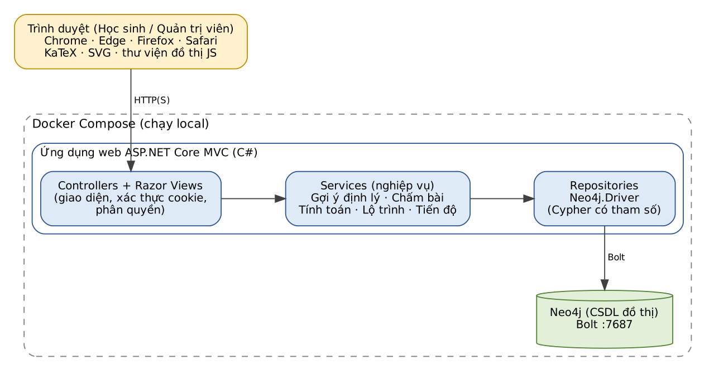
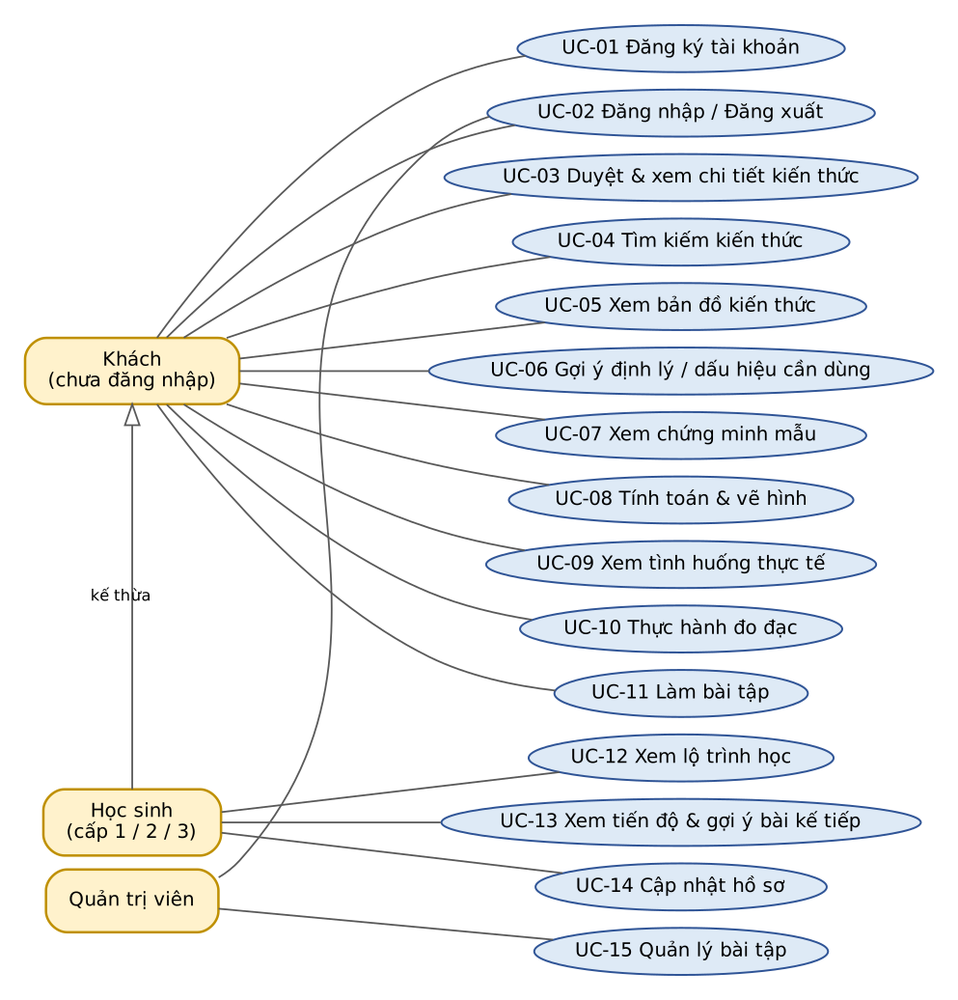
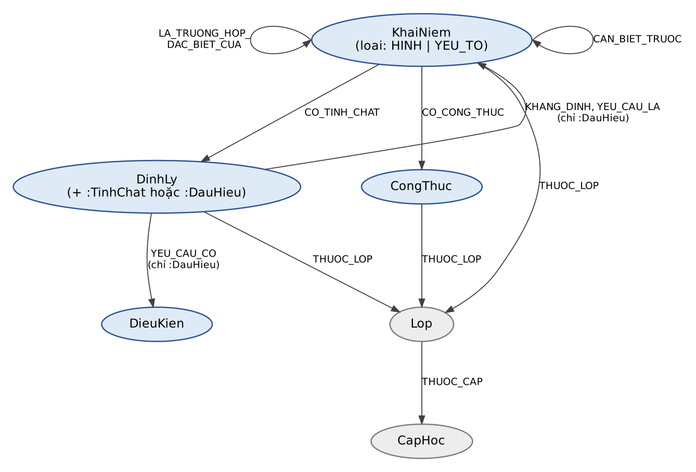
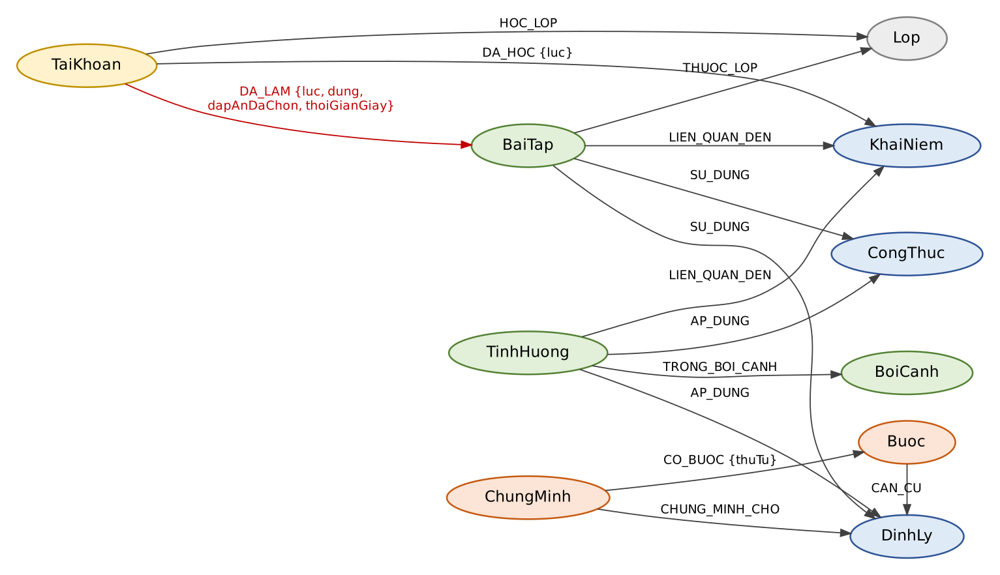
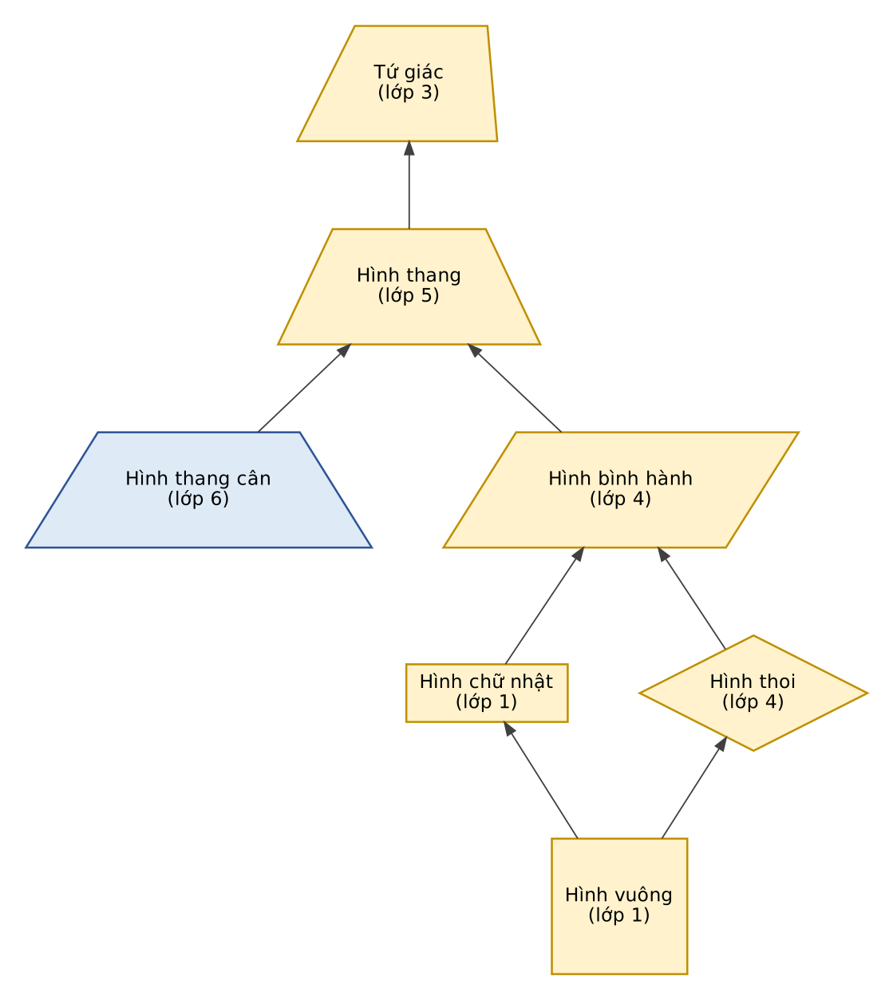

> Tài liệu này được chuyển tự động từ `GeoQuad_SRS.docx` sang Markdown để AI đọc. Bản gốc (docx) là bản chuẩn; hình nằm trong thư mục `GeoQuad_SRS_images/`, mỗi hình kèm mô tả bằng văn bản. Mục lục tự sinh của Word đã được lược bỏ (dùng các heading để điều hướng).

**PROJECT MINI – CHƯƠNG NEO4J**

**TÀI LIỆU ĐẶC TẢ**

**YÊU CẦU PHẦN MỀM**

Software Requirements Specification (SRS)

Cấu trúc theo ISO/IEC/IEEE 29148:2018

**GeoQuad**

Ứng dụng web giúp học sinh cấp 1, 2, 3 hiểu, nhớ và biết áp dụng kiến thức về tứ giác, dựa trên đồ thị tri thức Neo4j

| **Dự án** | GeoQuad (tên tạm thời) – ứng dụng web hỗ trợ học hình học phẳng, chủ đề Tứ giác |
| --- | --- |
| **Tài liệu** | Đặc tả yêu cầu phần mềm (SRS) |
| **Phiên bản** | 0.1 – Bản nháp để nhóm và giảng viên xem xét |
| **Ngày** | 02/10/2026 |
| **Học phần** | NoSQL – Project mini chương Neo4j |
| **Nhóm** | Nhóm 01 |
| **Thành viên** | Hồ Ngọc Phương Như<br>Nguyễn Anh Quân<br>Nguyễn Xuân Định |
| **Giảng viên** | Trần Quang Bình |

**Lịch sử thay đổi**

| **Phiên bản** | **Ngày** | **Người soạn** | **Nội dung thay đổi** |
| --- | --- | --- | --- |
| 0.1 | 02/10/2026 | Hồ Ngọc Phương Như | Bản nháp đầu tiên: phạm vi, yêu cầu chức năng, use case, mô hình dữ liệu Neo4j, yêu cầu phi chức năng, product backlog. |
|   |   |   |   |

**Soát xét và phê duyệt**

| **Vai trò** | **Họ tên** | **Chữ ký** | **Ngày** |
| --- | --- | --- | --- |
| Người soạn |   |   |   |
| Người rà soát nội dung toán |   |   |   |
| Giảng viên phê duyệt | Trần Quang Bình |   |   |

# 1. Giới thiệu

## 1.1 Mục đích

Tài liệu này đặc tả yêu cầu của hệ thống **GeoQuad**: ứng dụng web giúp học sinh cấp 1, 2, 3 hiểu và nhớ kiến thức hình học phẳng về tứ giác, biết chọn đúng định lý khi làm bài và thấy kiến thức được dùng ở đâu trong đời sống.

Tài liệu là cơ sở thống nhất giữa nhóm phát triển và giảng viên, đồng thời là đầu vào cho thiết kế, lập trình, kiểm thử và product backlog. Người đọc muốn xem nhanh nên đọc chương 2, mục 3.1 và Phụ lục C.

## 1.2 Phạm vi sản phẩm

GeoQuad là ứng dụng web chạy trên trình duyệt (điện thoại và máy tính), lưu toàn bộ tri thức và dữ liệu học tập trong cơ sở dữ liệu đồ thị Neo4j. Sản phẩm giải quyết hai khó khăn được nêu trong đề bài: học sinh không nhớ công thức, tính chất; và không biết chọn định lý nào khi làm bài, do học thiên về học vẹt và hàn lâm.

**Mục tiêu sản phẩm**

- **G1 – Dễ nhớ:** trình bày kiến thức như một bản đồ các hình liên hệ với nhau và gắn với tình huống thực tế (đo khung cửa, lát gạch, chia thửa đất) thay vì liệt kê rời rạc.
- **G2 – Biết chọn định lý:** từ hình đã biết, điều kiện đã có và hình cần chứng minh, hệ thống gợi ý dấu hiệu nhận biết nên dùng.
- **G3 – Học đúng sức:** nội dung và độ khó chia theo từng cấp, lớp; có lộ trình học, theo dõi tiến độ và gợi ý bài tập cho phần yếu.
- **G4 – Đúng chương trình:** nội dung bám Chương trình GDPT 2018, mỗi mục có nguồn đối chiếu.

**Trong phạm vi**

- Hình học phẳng, chủ đề tứ giác: tứ giác, hình thang, hình thang cân, hình bình hành, hình chữ nhật, hình thoi, hình vuông; kèm kiến thức nền về tam giác ở mức tối thiểu để phục vụ chứng minh.
- Ba cấp học (lớp 1–12), mỗi cấp có nội dung và độ khó riêng.
- Tra cứu, bản đồ kiến thức, gợi ý định lý, chứng minh mẫu, tính toán và vẽ hình, tình huống thực tế, bài tập có chấm tự động, lộ trình và tiến độ học.

**Ngoài phạm vi (đợt này)**

- Các chủ đề hình học khác (tam giác, đường tròn) và hình học không gian; có thể mở rộng sau (NFR-10).
- Ứng dụng di động cài đặt (có thể làm ở Release 2); chạy ngoại tuyến.
- Nhận diện đề bài từ ảnh, kiểm tra bài chứng minh tự viết, kéo đỉnh tương tác, huy hiệu (Release 2).
- Cổng riêng cho giáo viên, phụ huynh; thanh toán; mạng xã hội; đăng nhập bằng tài khoản bên thứ ba.

## 1.3 Định nghĩa, từ viết tắt

| **Thuật ngữ** | **Giải thích** |
| --- | --- |
| **SRS** | Software Requirements Specification – Tài liệu đặc tả yêu cầu phần mềm. |
| **FR / NFR** | Functional / Non-Functional Requirement – Yêu cầu chức năng / phi chức năng. |
| **UC** | Use Case – Ca sử dụng, mô tả một tương tác của người dùng với hệ thống để đạt một mục tiêu. |
| **BR** | Business Rule – Quy tắc nghiệp vụ. |
| **MVP** | Minimum Viable Product – Sản phẩm khả dụng tối thiểu, tương ứng Release 1 trong tài liệu này. |
| **MoSCoW** | Phương pháp xếp ưu tiên: Must (bắt buộc), Should (nên có), Could (có thể có), Won't (không làm đợt này). |
| **Product Backlog** | Danh sách có thứ tự ưu tiên các hạng mục công việc (user story) của sản phẩm trong Scrum. |
| **Sprint** | Khoảng thời gian cố định (ở đây 3 ngày) trong đó nhóm hoàn thành một phần backlog đã cam kết. |
| **Story Point (SP)** | Đơn vị ước lượng tương đối độ lớn của một user story (dãy 1, 2, 3, 5, 8). |
| **Neo4j** | Cơ sở dữ liệu đồ thị (graph database) lưu dữ liệu dưới dạng node và relationship. |
| **Cypher** | Ngôn ngữ truy vấn của Neo4j. |
| **Node / Label** | Nút (thực thể) trong đồ thị / nhãn phân loại nút, ví dụ KhaiNiem. |
| **Relationship** | Quan hệ có hướng, có kiểu giữa hai node, có thể mang thuộc tính. |
| **Property** | Thuộc tính dạng khóa–giá trị của node hoặc relationship. |
| **GDPT 2018** | Chương trình giáo dục phổ thông 2018 do Bộ Giáo dục và Đào tạo ban hành. |
| **SGK** | Sách giáo khoa. |
| **Dấu hiệu nhận biết** | Điều kiện đủ để kết luận một tứ giác thuộc một loại hình cụ thể (ví dụ hình bình hành có một góc vuông là hình chữ nhật). |
| **KaTeX** | Thư viện JavaScript hiển thị công thức toán. |
| **SVG** | Scalable Vector Graphics – định dạng ảnh vector dùng để vẽ hình trên web. |
| **p95** | Phân vị 95: 95% số yêu cầu có thời gian phản hồi không vượt quá giá trị này. |

## 1.4 Tài liệu tham chiếu

- ISO/IEC/IEEE 29148:2018 – Systems and software engineering – Life cycle processes – Requirements engineering (thay thế IEEE 830-1998).
- Bộ Giáo dục và Đào tạo, Chương trình giáo dục phổ thông – Môn Toán (ban hành kèm Thông tư 32/2018/TT-BGDĐT).
- Luật Bảo vệ dữ liệu cá nhân năm 2025 (có hiệu lực từ 01/01/2026) và các văn bản hướng dẫn; Nghị định 13/2023/NĐ-CP về bảo vệ dữ liệu cá nhân (cần kiểm tra hiệu lực hiện hành).
- Neo4j Cypher Manual và Neo4j .NET Driver Manual – https://neo4j.com/docs/
- W3C Web Content Accessibility Guidelines (WCAG) 2.1.
- Sách giáo khoa Toán các lớp 1–12 theo bộ sách nhóm chọn đối chiếu (xem OI-02).

## 1.5 Quy ước

| **Mã** | **Ý nghĩa** |
| --- | --- |
| FR-xx | Yêu cầu chức năng (đánh số theo nhóm chức năng: 0x tài khoản, 1x tra cứu, 2x chứng minh, 3x tính toán, 4x thực tế, 5x bài tập, 6x học tập, 7x quản trị, 8x khuyến khích). |
| NFR-xx | Yêu cầu phi chức năng. |
| UC-xx / SCR-xx | Use case / màn hình giao diện. |
| BR-xx | Quy tắc nghiệp vụ. |
| US-xx / EP-xx | User story / epic trong product backlog. |
| C-xx, A-xx, RK-xx, OI-xx | Ràng buộc, giả định, rủi ro, vấn đề còn mở. |
| Must / Should / Could | Độ ưu tiên theo MoSCoW. **Must**: cam kết làm trong Release 1; **Should**: làm nếu còn năng lực trong Release 1; **Could**: để Release 2. |
| R1 / R2 | Release 1 (trong thời hạn 1 tuần) / Release 2 (hướng phát triển). |

# 2. Mô tả tổng quan

## 2.1 Bối cảnh và hướng giải quyết

Học sinh thường học hình học theo kiểu thuộc lòng: nhớ công thức nhưng không biết dùng khi nào, nhớ tính chất nhưng không biết chọn định lý nào cho bài đang làm. Kiến thức được trình bày rời rạc, ít gắn với đời sống nên khó nhớ lâu.

GeoQuad tiếp cận bằng ba ý:

- **Kiến thức là một mạng lưới.** Hình vuông là trường hợp đặc biệt của hình chữ nhật và hình thoi; dấu hiệu nhận biết nối từ điều kiện tới hình được kết luận; khái niệm này cần biết trước khái niệm kia. Đây là dữ liệu dạng đồ thị nên lưu và truy vấn bằng Neo4j.
- **Trả lời câu hỏi "dùng định lý nào".** Truy vấn đồ thị từ hình đã biết và điều kiện đã có để ra các dấu hiệu nhận biết còn thiếu bao nhiêu điều kiện.
- **Gắn kiến thức với việc thật.** Mỗi tình huống thực tế (kiểm tra khung cửa bằng hai đường chéo, tính gạch lát nền, chia thửa đất hình thang) liên kết tới đúng định lý và công thức cần dùng, kèm lời giải thích "vì sao đúng".

Ví dụ: thợ mộc muốn biết khung cửa có vuông góc không thì đo hai cặp cạnh đối và hai đường chéo. Nếu các cạnh đối bằng nhau thì khung là hình bình hành; nếu thêm hai đường chéo bằng nhau thì khung là hình chữ nhật. Học sinh thấy ngay "hình bình hành có hai đường chéo bằng nhau là hình chữ nhật" dùng để làm gì.

## 2.2 Các nhóm chức năng

| **Mã** | **Nhóm chức năng** | **Yêu cầu chức năng** |
| --- | --- | --- |
| M1 | Tài khoản & phân quyền | FR-01, FR-02, FR-03, FR-04 |
| M2 | Tra cứu kiến thức | FR-10, FR-11, FR-12, FR-13 |
| M3 | Hỗ trợ chứng minh | FR-20, FR-21, FR-22 |
| M4 | Tính toán & trực quan | FR-30, FR-31, FR-32, FR-33, FR-34 |
| M5 | Bài toán thực tế | FR-40, FR-41 |
| M6 | Bài tập & chấm bài | FR-50, FR-51, FR-52 |
| M7 | Học tập cá nhân hóa | FR-60, FR-61, FR-62 |
| M8 | Quản trị nội dung | FR-70, FR-71, FR-72 |
| M9 | Khuyến khích học tập | FR-80 |

## 2.3 Người dùng

| **Nhóm** | **Mô tả và nhu cầu** |
| --- | --- |
| **Khách** | Người chưa đăng nhập. Tra cứu, tính toán, xem tình huống, làm bài thử; không lưu được tiến độ (BR-09). |
| **Học sinh** | Kế thừa mọi quyền của Khách; thêm lộ trình học, tiến độ, lưu kết quả làm bài, hồ sơ. Học sinh thuộc một lớp (1–12) tại một thời điểm và được xếp vào cấp tương ứng (BR-03). |
| **Quản trị viên** | Thành viên nhóm hoặc giáo viên phụ trách nội dung; quản lý ngân hàng bài tập (Release 1), quản lý toàn bộ nội dung kiến thức (Release 2). |

**Đặc điểm theo cấp học** (cấp là thuộc tính của hồ sơ học sinh, không phải một loại tác nhân khác):

| **Cấp** | **Lớp (độ tuổi gần đúng)** | **Định hướng nội dung và giao diện** |
| --- | --- | --- |
| **Cấp 1** | Lớp 1–5 (6–11 tuổi) | Nhận biết hình, chu vi, diện tích. Giao diện nhiều hình ảnh, ít chữ, nút lớn, câu chữ đơn giản; không hiển thị chứng minh. Ví dụ thực tế gần gũi (tờ giấy, viên gạch, mảnh vườn). |
| **Cấp 2** | Lớp 6–9 (11–15 tuổi) | Tính chất, dấu hiệu nhận biết, chứng minh cơ bản về tứ giác; công thức đường chéo (Pythagore). Đây là nhóm sử dụng chính tính năng gợi ý định lý. |
| **Cấp 3** | Lớp 10–12 (15–18 tuổi) | Gặp lại tứ giác qua vectơ và tọa độ; chứng minh bằng vectơ. Nhận dạng tứ giác từ tọa độ để dành Release 2 (FR-34). |

## 2.4 Môi trường vận hành và kiến trúc đề xuất



*Hình 1. Kiến trúc đề xuất: trình duyệt – ứng dụng web ASP.NET Core MVC – Neo4j, đóng gói bằng Docker Compose*

> **Mô tả hình (văn bản cho AI):** Trình duyệt (Học sinh/Quản trị viên; Chrome, Edge, Firefox, Safari; KaTeX, SVG, thư viện đồ thị JS) --HTTP(S)--> khối Docker Compose (chạy local) chứa ứng dụng ASP.NET Core MVC (C#) gồm chuỗi: Controllers + Razor Views (giao diện, xác thực cookie, phân quyền) → Services (nghiệp vụ: gợi ý định lý, chấm bài, tính toán, lộ trình, tiến độ) → Repositories (Neo4j.Driver, Cypher có tham số); Repositories --Bolt :7687--> Neo4j (CSDL đồ thị).

| **Lớp** | **Công nghệ đề xuất** | **Lý do** |
| --- | --- | --- |
| Giao diện | Razor Views (kết xuất phía máy chủ), Bootstrap 5, JavaScript | Nhanh dựng, đáp ứng (responsive) cho điện thoại; ít thành phần cho nhóm 3 người trong 1 tuần. |
| Công thức, hình vẽ | KaTeX; SVG sinh bằng JavaScript; Cytoscape.js (hoặc vis-network) cho bản đồ kiến thức | Hiển thị toán rõ nét, hình vẽ tỉ lệ, đồ thị có tương tác. |
| Máy chủ ứng dụng | ASP.NET Core MVC (C#, bản LTS mới nhất của .NET) | Nhóm quen C#; một dự án duy nhất thay vì tách API và giao diện. |
| Truy cập dữ liệu | Neo4j.Driver (NuGet); lớp Repository chứa truy vấn Cypher có tham số | Driver chính thức; tách truy vấn khỏi nghiệp vụ. |
| Cơ sở dữ liệu | Neo4j Community (bản ổn định mới nhất), chạy bằng Docker | Yêu cầu của giảng viên (C-01); dữ liệu tri thức dạng đồ thị. |
| Xác thực | Cookie authentication của ASP.NET Core + PasswordHasher (PBKDF2); không dùng ASP.NET Identity/EF | Đơn giản, không cần kho người dùng riêng cho Neo4j; tài khoản là node TaiKhoan. |
| Đóng gói, chạy | Docker Compose | Một lệnh khởi động đủ hệ thống (NFR-13). |
| Kiểm thử | xUnit cho lớp Service (tính toán, chấm bài, gợi ý); kiểm thử thủ công theo tiêu chí chấp nhận | Phần logic dễ sai nhất có kiểm thử tự động. |

**Lưu ý:** bảng công nghệ là đề xuất của nhóm phân tích sau khi nhóm chốt làm web; nhóm cần xác nhận. Phương án Flutter (web/di động) vẫn khả thi nhưng cần xây thêm lớp API và nặng hơn khi tải trang đầu; nên để cho Release 2 nếu muốn có ứng dụng di động dùng chung lớp Service.

**Môi trường chạy:** Docker Desktop hoặc Docker Engine trên máy phát triển và máy demo; trình duyệt Chrome, Edge, Firefox, Safari bản mới (NFR-04).

## 2.5 Ràng buộc

| **Mã** | **Nội dung** |
| --- | --- |
| C-01 | Bắt buộc dùng Neo4j làm cơ sở dữ liệu (yêu cầu của giảng viên cho project mini chương Neo4j). |
| C-02 | Thời hạn 1 tuần cho SRS, mã nguồn, bản demo và product backlog. |
| C-03 | Nhóm 3 thành viên, quen C#, Flutter; công nghệ chọn phải phù hợp năng lực này. |
| C-04 | Phạm vi nội dung: hình học phẳng, chủ đề tứ giác (kèm kiến thức nền tam giác tối thiểu phục vụ chứng minh), bám Chương trình GDPT 2018 và được mở rộng tính năng. |
| C-05 | Nền tảng: ứng dụng web (nhóm chốt để triển khai nhanh), chạy local khi demo. |
| C-06 | Chỉ dùng phần mềm và thư viện miễn phí/mã nguồn mở. |

## 2.6 Giả định và phụ thuộc

| **Mã** | **Nội dung** |
| --- | --- |
| A-01 | Nhóm tự nhập dữ liệu kiến thức ban đầu bằng script Cypher: 7 hình, 14 điều kiện, 20 dấu hiệu nhận biết, 12 tính chất, 12 công thức, 9 tình huống thực tế, 4 chứng minh mẫu (đã liệt kê ở Phụ lục B) và khoảng 30 bài tập do nhóm tự soạn. |
| A-02 | Người dùng luôn có kết nối mạng khi sử dụng (không hỗ trợ ngoại tuyến ở Release 1). |
| A-03 | Người dùng dùng trình duyệt hiện đại có bật JavaScript. |
| A-04 | Giảng viên chấp nhận hình thức ứng dụng web cho đề tài "xây dựng ứng dụng" (xem OI-01). |
| A-05 | Không tích hợp hệ thống bên ngoài (đăng nhập mạng xã hội, thanh toán, thông báo đẩy) ở Release 1. |

## 2.7 Phân kỳ phát hành

| **Nhóm** | **Phát hành** | **Yêu cầu chức năng** |
| --- | --- | --- |
| **Must** | R1 – cam kết | FR-01 Đăng ký tài khoản học sinh<br>FR-02 Đăng nhập / đăng xuất, phân quyền<br>FR-03 Chế độ khách<br>FR-10 Duyệt thư viện kiến thức<br>FR-11 Xem chi tiết khái niệm<br>FR-12 Tìm kiếm thông minh<br>FR-13 Bản đồ kiến thức<br>FR-20 Gợi ý định lý / dấu hiệu cần dùng<br>FR-40 Tình huống thực tế gắn với kiến thức<br>FR-50 Duyệt ngân hàng bài tập<br>FR-51 Làm bài và chấm tự động<br>FR-60 Lộ trình học |
| **Should** | R1 – nếu còn năng lực | FR-04 Cập nhật hồ sơ<br>FR-21 Xem chứng minh mẫu từng bước<br>FR-30 Tính chu vi, diện tích, đường chéo<br>FR-31 Vẽ hình theo số liệu<br>FR-41 Thực hành đo đạc<br>FR-52 Xem lời giải mẫu bài tự luận<br>FR-61 Theo dõi tiến độ, phần yếu<br>FR-62 Gợi ý bài tập kế tiếp<br>FR-70 Quản lý bài tập |
| **Could** | R2 – hướng phát triển | FR-22 Kiểm tra bài chứng minh của học sinh<br>FR-32 Kéo đỉnh để quan sát tính chất<br>FR-33 Nhận diện đề bài từ ảnh chụp<br>FR-34 Nhận dạng tứ giác từ tọa độ (cấp 3)<br>FR-71 Quản lý nội dung kiến thức<br>FR-72 Nhập dữ liệu hàng loạt<br>FR-80 Huy hiệu và chuỗi ngày học |

Nhóm Must là tập tối thiểu để demo trọn vẹn bài toán của đề tài (đồ thị tri thức, gợi ý định lý, tình huống thực tế, bài tập, lộ trình). Nếu sau Sprint 1 tốc độ làm việc thực tế thấp hơn dự kiến, nhóm giữ nguyên Must và dời các mục Should (xem Phụ lục C).

# 3. Yêu cầu chức năng

## 3.1 Danh sách yêu cầu chức năng

| **Mã** | **Chức năng** | **Mô tả** | **Ưu tiên** | **Phát hành** | **Use case** |
| --- | --- | --- | --- | --- | --- |
| **M1 – Tài khoản & phân quyền** |   |   |   |   |   |
| FR-01 | **Đăng ký tài khoản học sinh** | Khách tạo tài khoản bằng tên đăng nhập và mật khẩu, nhập biệt danh, chọn cấp/lớp; không bắt buộc email hay số điện thoại. | Must | R1 | UC-01 |
| FR-02 | **Đăng nhập / đăng xuất, phân quyền** | Xác thực bằng tên đăng nhập và mật khẩu; phân quyền theo vai trò (Học sinh, Quản trị viên); khóa tạm khi nhập sai liên tiếp. | Must | R1 | UC-02 |
| FR-03 | **Chế độ khách** | Người chưa đăng nhập vẫn tra cứu, tính toán, xem tình huống và làm bài thử; kết quả không được lưu. | Must | R1 | UC-03 |
| FR-04 | **Cập nhật hồ sơ** | Học sinh đổi biệt danh, lớp, mật khẩu. | Should | R1 | UC-14 |
| **M2 – Tra cứu kiến thức** |   |   |   |   |   |
| FR-10 | **Duyệt thư viện kiến thức** | Danh sách khái niệm, tính chất, dấu hiệu nhận biết, công thức; lọc theo cấp, lớp, loại nội dung. | Must | R1 | UC-03 |
| FR-11 | **Xem chi tiết khái niệm** | Định nghĩa, hình minh họa, tính chất, dấu hiệu nhận biết, công thức (hiển thị công thức toán), tình huống thực tế và bài tập liên quan. | Must | R1 | UC-03 |
| FR-12 | **Tìm kiếm thông minh** | Gõ từ khóa (có dấu hoặc không dấu) như "hình thoi" để ra ngay khái niệm, tính chất, dấu hiệu, công thức liên quan. | Must | R1 | UC-04 |
| FR-13 | **Bản đồ kiến thức** | Hiển thị đồ thị các hình tứ giác và quan hệ "là trường hợp đặc biệt của"; lọc theo lớp; chọn nút để xem chi tiết. | Must | R1 | UC-05 |
| **M3 – Hỗ trợ chứng minh** |   |   |   |   |   |
| FR-20 | **Gợi ý định lý / dấu hiệu cần dùng** | Người dùng chọn hình đã biết, tích các điều kiện đã có, chọn hình cần chứng minh; hệ thống tra đồ thị và gợi ý dấu hiệu nhận biết, xếp theo số điều kiện còn thiếu. | Must | R1 | UC-06 |
| FR-21 | **Xem chứng minh mẫu từng bước** | Hiển thị giả thiết, kết luận, các bước chứng minh; mỗi bước nêu căn cứ (định lý/tính chất) có liên kết. | Should | R1 | UC-07 |
| FR-22 | **Kiểm tra bài chứng minh của học sinh** | Học sinh nhập các bước tự viết; hệ thống chỉ ra bước thiếu căn cứ hoặc dùng sai định lý. | Could | R2 | UC-18 |
| **M4 – Tính toán & trực quan** |   |   |   |   |   |
| FR-30 | **Tính chu vi, diện tích, đường chéo** | Chọn hình và đại lượng, nhập số đo; hiển thị công thức, các bước thay số, kết quả kèm đơn vị. | Should | R1 | UC-08 |
| FR-31 | **Vẽ hình theo số liệu** | Vẽ hình tỉ lệ (SVG) theo số đo vừa nhập, ghi nhãn đỉnh, cạnh, góc. | Should | R1 | UC-08 |
| FR-32 | **Kéo đỉnh để quan sát tính chất** | Hình tương tác: kéo đỉnh và quan sát đại lượng không đổi (kiểu GeoGebra). | Could | R2 | UC-19 |
| FR-33 | **Nhận diện đề bài từ ảnh chụp** | Chụp hoặc tải ảnh đề bài, hệ thống trích xuất nội dung (OCR). | Could | R2 | UC-20 |
| FR-34 | **Nhận dạng tứ giác từ tọa độ (cấp 3)** | Nhập tọa độ bốn đỉnh; hệ thống tính vectơ, độ dài, tích vô hướng và kết luận hình dạng. | Could | R2 | UC-22 |
| **M5 – Bài toán thực tế** |   |   |   |   |   |
| FR-40 | **Tình huống thực tế gắn với kiến thức** | Danh sách tình huống theo bối cảnh (Nhà cửa, Mảnh vườn/thửa đất, Đồ dùng/sân chơi); mỗi tình huống nêu kiến thức được dùng và giải thích vì sao đúng. | Must | R1 | UC-09 |
| FR-41 | **Thực hành đo đạc** | Nhập số đo thực tế (cạnh, đường chéo) để kiểm tra hình dạng (ví dụ khung cửa có vuông góc không) và nhận kết luận kèm dấu hiệu đã dùng. | Should | R1 | UC-10 |
| **M6 – Bài tập & chấm bài** |   |   |   |   |   |
| FR-50 | **Duyệt ngân hàng bài tập** | Lọc bài tập theo cấp, lớp, dạng, độ khó, khái niệm. | Must | R1 | UC-11 |
| FR-51 | **Làm bài và chấm tự động** | Trắc nghiệm 4 đáp án và nhập đáp án số được chấm tự động; hiển thị đáp án, giải thích, định lý/công thức liên quan. | Must | R1 | UC-11 |
| FR-52 | **Xem lời giải mẫu bài tự luận** | Bài chứng minh tự luận không chấm tự động; học sinh xem lời giải mẫu. | Should | R1 | UC-11 |
| **M7 – Học tập cá nhân hóa** |   |   |   |   |   |
| FR-60 | **Lộ trình học** | Từ một khái niệm mục tiêu, hệ thống liệt kê các khái niệm cần học trước theo đúng thứ tự, đánh dấu đã học/chưa học. | Must | R1 | UC-12 |
| FR-61 | **Theo dõi tiến độ, phần yếu** | Thống kê số bài đã làm, tỉ lệ đúng theo khái niệm; liệt kê khái niệm cần ôn lại. | Should | R1 | UC-13 |
| FR-62 | **Gợi ý bài tập kế tiếp** | Gợi ý bài chưa làm đúng, thuộc các khái niệm yếu, đúng lớp, độ khó tăng dần. | Should | R1 | UC-13 |
| **M8 – Quản trị nội dung** |   |   |   |   |   |
| FR-70 | **Quản lý bài tập** | Quản trị viên thêm, sửa, ẩn bài tập; gắn lớp, độ khó, khái niệm/định lý liên quan, đáp án, giải thích. | Should | R1 | UC-15 |
| FR-71 | **Quản lý nội dung kiến thức** | Thêm, sửa khái niệm, tính chất, dấu hiệu, công thức, tình huống, chứng minh mẫu và các quan hệ giữa chúng. | Could | R2 | UC-16 |
| FR-72 | **Nhập dữ liệu hàng loạt** | Nhập nội dung kiến thức và bài tập từ tệp CSV/JSON, có báo cáo lỗi từng dòng. | Could | R2 | UC-17 |
| **M9 – Khuyến khích học tập** |   |   |   |   |   |
| FR-80 | **Huy hiệu và chuỗi ngày học** | Trao huy hiệu khi đạt mốc, hiển thị chuỗi ngày học liên tục. | Could | R2 | UC-21 |

## 3.2 Sơ đồ use case



*Hình 2. Sơ đồ use case Release 1 (Học sinh kế thừa mọi use case của Khách)*

> **Mô tả hình (văn bản cho AI):** Ba tác nhân: Khách (chưa đăng nhập), Học sinh (cấp 1/2/3) kế thừa Khách, Quản trị viên. Khách: UC-01 Đăng ký tài khoản, UC-02 Đăng nhập/Đăng xuất, UC-03 Duyệt & xem chi tiết kiến thức, UC-04 Tìm kiếm kiến thức, UC-05 Xem bản đồ kiến thức, UC-06 Gợi ý định lý/dấu hiệu cần dùng, UC-07 Xem chứng minh mẫu, UC-08 Tính toán & vẽ hình, UC-09 Xem tình huống thực tế, UC-10 Thực hành đo đạc, UC-11 Làm bài tập. Học sinh (thêm): UC-12 Xem lộ trình học, UC-13 Xem tiến độ & gợi ý bài kế tiếp, UC-14 Cập nhật hồ sơ. Quản trị viên: UC-15 Quản lý bài tập; cũng liên kết với UC-02 Đăng nhập/Đăng xuất.

## 3.3 Danh sách use case

| **Mã** | **Tên use case** | **Tác nhân** | **FR liên quan** | **Phát hành** |
| --- | --- | --- | --- | --- |
| UC-01 | Đăng ký tài khoản | Khách | FR-01 | R1 |
| UC-02 | Đăng nhập / đăng xuất | Khách, Quản trị viên | FR-02 | R1 |
| UC-03 | Duyệt và xem chi tiết kiến thức | Khách, Học sinh | FR-03, FR-10, FR-11 | R1 |
| UC-04 | Tìm kiếm kiến thức | Khách, Học sinh | FR-12 | R1 |
| UC-05 | Xem bản đồ kiến thức | Khách, Học sinh | FR-13 | R1 |
| UC-06 | Gợi ý định lý / dấu hiệu cần dùng | Khách, Học sinh | FR-20 | R1 |
| UC-07 | Xem chứng minh mẫu | Khách, Học sinh | FR-21 | R1 |
| UC-08 | Tính toán và vẽ hình | Khách, Học sinh | FR-30, FR-31 | R1 |
| UC-09 | Xem tình huống thực tế | Khách, Học sinh | FR-40 | R1 |
| UC-10 | Thực hành đo đạc | Khách, Học sinh | FR-41 | R1 |
| UC-11 | Làm bài tập | Khách, Học sinh | FR-50, FR-51, FR-52 | R1 |
| UC-12 | Xem lộ trình học | Học sinh | FR-60 | R1 |
| UC-13 | Xem tiến độ và gợi ý bài kế tiếp | Học sinh | FR-61, FR-62 | R1 |
| UC-14 | Cập nhật hồ sơ | Học sinh | FR-04 | R1 |
| UC-15 | Quản lý bài tập | Quản trị viên | FR-70 | R1 |
| UC-16 | Quản lý nội dung kiến thức | Quản trị viên | FR-71 | R2 |
| UC-17 | Nhập dữ liệu hàng loạt | Quản trị viên | FR-72 | R2 |
| UC-18 | Kiểm tra bài chứng minh của học sinh | Học sinh | FR-22 | R2 |
| UC-19 | Kéo đỉnh để quan sát tính chất | Khách, Học sinh | FR-32 | R2 |
| UC-20 | Nhận diện đề bài từ ảnh | Khách, Học sinh | FR-33 | R2 |
| UC-21 | Huy hiệu và chuỗi ngày học | Học sinh | FR-80 | R2 |
| UC-22 | Nhận dạng tứ giác từ tọa độ | Học sinh (cấp 3) | FR-34 | R2 |

## 3.4 Đặc tả use case

Mỗi use case Release 1 được đặc tả theo mẫu: tác nhân, mô tả, điều kiện, luồng chính, luồng thay thế, quy tắc nghiệp vụ và tiêu chí chấp nhận (viết theo dạng "Cho … khi … thì …" để làm cơ sở kiểm thử). Use case Release 2 chỉ mô tả ngắn ở cuối mục.

### UC-01 – Đăng ký tài khoản

| **Tác nhân** | Khách |
| --- | --- |
| **FR liên quan** | FR-01 |
| **Mô tả** | Khách tạo tài khoản học sinh để lưu tiến độ học tập. |
| **Tiền điều kiện** | Người dùng chưa đăng nhập. |
| **Hậu điều kiện** | Tài khoản (vai trò Học sinh) được tạo và liên kết với lớp đã chọn; người dùng được đăng nhập tự động. |
| **Luồng chính** | Khách mở trang Đăng ký.<br>Hệ thống hiển thị biểu mẫu: tên đăng nhập, mật khẩu, nhập lại mật khẩu, biệt danh hiển thị, lớp (1–12), ô xác nhận đã đọc thông báo quyền riêng tư và đã được cha mẹ/người giám hộ đồng ý (nếu dưới 16 tuổi).<br>Khách nhập thông tin và gửi.<br>Hệ thống kiểm tra hợp lệ dữ liệu và tính duy nhất của tên đăng nhập.<br>Hệ thống băm mật khẩu, tạo tài khoản, liên kết với lớp đã chọn.<br>Hệ thống đăng nhập tự động và chuyển về Trang chủ. |
| **Luồng thay thế / ngoại lệ** | 3a. Khách không tích ô xác nhận: hệ thống không cho gửi và nhắc lý do.<br>4a. Dữ liệu không hợp lệ: hiển thị lỗi cạnh từng trường, giữ nguyên dữ liệu đã nhập (trừ mật khẩu).<br>4b. Tên đăng nhập đã tồn tại: báo lỗi và đề nghị chọn tên khác. |
| **Quy tắc nghiệp vụ** | BR-01, BR-02, BR-03, BR-12 |
| **Tiêu chí chấp nhận** | Cho tên đăng nhập chưa dùng và mật khẩu ≥ 8 ký tự, khi gửi biểu mẫu thì tài khoản được tạo và mật khẩu được lưu dạng băm.<br>Cho tên đăng nhập đã tồn tại, khi gửi thì hệ thống báo lỗi và không tạo tài khoản trùng. |

### UC-02 – Đăng nhập / đăng xuất

| **Tác nhân** | Khách, Quản trị viên |
| --- | --- |
| **FR liên quan** | FR-02 |
| **Mô tả** | Người dùng xác thực để sử dụng chức năng cần tài khoản; đăng xuất để kết thúc phiên. |
| **Tiền điều kiện** | Tài khoản đã tồn tại (đăng nhập) hoặc đang đăng nhập (đăng xuất). |
| **Hậu điều kiện** | Phiên làm việc được tạo (hoặc hủy) và giao diện chuyển theo vai trò. |
| **Luồng chính** | Người dùng mở trang Đăng nhập, nhập tên đăng nhập và mật khẩu.<br>Hệ thống xác thực thông tin.<br>Hệ thống tạo phiên đăng nhập (cookie) và chuyển tới Trang chủ (Học sinh) hoặc trang Quản trị (Quản trị viên).<br>Để đăng xuất, người dùng chọn "Đăng xuất"; hệ thống hủy phiên và về Trang chủ. |
| **Luồng thay thế / ngoại lệ** | 2a. Sai tên đăng nhập hoặc mật khẩu: báo "Tên đăng nhập hoặc mật khẩu không đúng" (không nêu trường nào sai).<br>2b. Sai 5 lần liên tiếp: khóa đăng nhập tài khoản đó 5 phút và thông báo thời gian chờ. |
| **Quy tắc nghiệp vụ** | BR-02 |
| **Tiêu chí chấp nhận** | Cho thông tin đúng, khi đăng nhập thì chuyển đúng trang theo vai trò.<br>Cho nhập sai 5 lần liên tiếp, khi thử lần thứ 6 trong 5 phút thì bị từ chối kể cả nhập đúng. |

### UC-03 – Duyệt và xem chi tiết kiến thức

| **Tác nhân** | Khách, Học sinh |
| --- | --- |
| **FR liên quan** | FR-03, FR-10, FR-11 |
| **Mô tả** | Người dùng duyệt thư viện và đọc chi tiết một khái niệm (hình), kèm tính chất, dấu hiệu nhận biết, công thức. Khách dùng được chức năng này nhưng không lưu dấu "đã học". |
| **Tiền điều kiện** | Không có. |
| **Hậu điều kiện** | Người dùng xem được nội dung; nếu là Học sinh và bấm "Em đã hiểu", khái niệm được đánh dấu đã học. |
| **Luồng chính** | Người dùng mở "Thư viện kiến thức".<br>Hệ thống hiển thị danh sách khái niệm theo lớp (Học sinh: mặc định lớp của mình; Khách: chọn lớp trên giao diện).<br>Người dùng lọc theo cấp, lớp, loại nội dung (hình, tính chất, dấu hiệu, công thức).<br>Người dùng chọn một khái niệm.<br>Hệ thống hiển thị chi tiết: định nghĩa, hình minh họa, tính chất, dấu hiệu nhận biết, công thức, tình huống thực tế liên quan, bài tập liên quan, các hình liên quan (tổng quát hơn/đặc biệt hơn).<br>Học sinh bấm "Em đã hiểu"; hệ thống ghi nhận đã học. |
| **Luồng thay thế / ngoại lệ** | 2a. Nội dung thuộc lớp cao hơn: ẩn mặc định; nếu người dùng bật "xem trước kiến thức nâng cao" thì hiển thị kèm nhãn "Nâng cao" (BR-04).<br>5a. Khái niệm chưa có tính chất/dấu hiệu/công thức: ẩn mục tương ứng thay vì hiển thị mục rỗng.<br>6a. Khách bấm "Em đã hiểu": mời đăng nhập, không lưu (BR-09). |
| **Quy tắc nghiệp vụ** | BR-04, BR-09, BR-11, BR-13 |
| **Tiêu chí chấp nhận** | Cho khái niệm "Hình chữ nhật", khi mở chi tiết thì hiển thị định nghĩa, tính chất, dấu hiệu nhận biết và công thức chu vi, diện tích đúng định dạng toán.<br>Cho học sinh lớp 4, khi duyệt thư viện thì không thấy "Hình thang cân" (lớp 6) trừ khi bật xem trước kiến thức nâng cao. |

### UC-04 – Tìm kiếm kiến thức

| **Tác nhân** | Khách, Học sinh |
| --- | --- |
| **FR liên quan** | FR-12 |
| **Mô tả** | Người dùng gõ từ khóa để tìm khái niệm, tính chất, dấu hiệu, công thức. |
| **Tiền điều kiện** | Không có. |
| **Hậu điều kiện** | Hiển thị danh sách kết quả liên kết tới trang chi tiết. |
| **Luồng chính** | Người dùng nhập từ khóa vào ô tìm kiếm (ở đầu mọi trang) và gửi.<br>Hệ thống thoát ký tự đặc biệt, tìm trên chỉ mục full-text.<br>Hệ thống hiển thị kết quả gom theo loại (Khái niệm, Tính chất & dấu hiệu, Công thức), kèm đoạn trích và lớp.<br>Người dùng chọn một kết quả để xem chi tiết. |
| **Luồng thay thế / ngoại lệ** | 3a. Không có kết quả: hiển thị thông báo, gợi ý kiểm tra chính tả và nút "Duyệt thư viện".<br>1a. Từ khóa trống: không gửi, nhắc nhập từ khóa. |
| **Quy tắc nghiệp vụ** | BR-04 |
| **Tiêu chí chấp nhận** | Cho từ khóa "hinh thoi" và "hình thoi", khi tìm thì khái niệm "Hình thoi" đứng đầu ở cả hai trường hợp (NFR-14).<br>Cho từ khóa chứa ký tự đặc biệt như "(" hoặc "*", khi tìm thì không phát sinh lỗi hệ thống. |

### UC-05 – Xem bản đồ kiến thức

| **Tác nhân** | Khách, Học sinh |
| --- | --- |
| **FR liên quan** | FR-13 |
| **Mô tả** | Hiển thị quan hệ giữa các hình tứ giác dưới dạng đồ thị để học sinh thấy hình nào là trường hợp đặc biệt của hình nào. |
| **Tiền điều kiện** | Không có. |
| **Hậu điều kiện** | Người dùng quan sát đồ thị và có thể đi tới chi tiết từng hình. |
| **Luồng chính** | Người dùng mở "Bản đồ kiến thức".<br>Hệ thống truy vấn các hình thuộc lớp đang chọn và quan hệ "là trường hợp đặc biệt của", rồi vẽ đồ thị (nút = hình, mũi tên = đặc biệt hóa).<br>Người dùng chọn lớp để lọc; đồ thị cập nhật.<br>Người dùng chọn một nút; hệ thống hiển thị khung tóm tắt (định nghĩa, lớp) và liên kết "Xem chi tiết".<br>Học sinh đã đăng nhập thấy các nút đã học được tô viền riêng. |
| **Luồng thay thế / ngoại lệ** | 2a. Lớp chưa có quan hệ nào (ví dụ lớp 1): hiển thị các nút rời và lời giải thích. |
| **Quy tắc nghiệp vụ** | BR-04, BR-11 |
| **Tiêu chí chấp nhận** | Cho lớp 8, khi mở bản đồ thì "Hình vuông" có mũi tên tới "Hình chữ nhật" và "Hình thoi"; đồ thị không có chu trình.<br>Cho lớp 3, khi mở bản đồ thì không hiển thị "Hình thang cân". |

### UC-06 – Gợi ý định lý / dấu hiệu cần dùng

| **Tác nhân** | Khách, Học sinh |
| --- | --- |
| **FR liên quan** | FR-20 |
| **Mô tả** | Giúp học sinh trả lời "gặp bài này nên dùng định lý nào": từ hình đã biết và điều kiện đã có, hệ thống gợi ý các dấu hiệu nhận biết để kết luận hình cần chứng minh. |
| **Tiền điều kiện** | Có dữ liệu dấu hiệu nhận biết trong đồ thị. |
| **Hậu điều kiện** | Danh sách gợi ý được hiển thị, mỗi gợi ý cho biết điều kiện đã đủ và còn thiếu. |
| **Luồng chính** | Người dùng mở "Nên dùng định lý nào?".<br>Bước 1: chọn "Tứ giác ABCD đã biết là" một trong các hình (mặc định "Tứ giác").<br>Bước 2: tích các điều kiện đã có (ví dụ "Có một góc vuông", "Hai đường chéo bằng nhau").<br>Bước 3: chọn "Cần chứng minh ABCD là" hình đích.<br>Hệ thống tra đồ thị: lấy các dấu hiệu khẳng định hình đích, giữ lại những dấu hiệu có hình nền thỏa BR-07, tính các điều kiện còn thiếu.<br>Hệ thống hiển thị danh sách xếp theo số điều kiện còn thiếu tăng dần; mỗi mục có phát biểu dấu hiệu, dấu ✓ cho điều kiện đã đủ và dấu ✗ cho điều kiện còn thiếu, lớp học, liên kết "Xem chứng minh mẫu" (nếu có) và "Bài tập liên quan". |
| **Luồng thay thế / ngoại lệ** | 5a. Hình đích đã suy ra trực tiếp từ hình đã biết (ví dụ chọn hình vuông, cần chứng minh hình chữ nhật): hiển thị "Mọi hình vuông đều là hình chữ nhật" và dừng.<br>5b. Không có dấu hiệu trực tiếp nhưng có chuỗi bước trung gian (ví dụ Tứ giác → Hình bình hành → Hình chữ nhật): đề xuất chuỗi tối đa 3 bước, mỗi bước là một dấu hiệu (mức Should, có thể hoãn).<br>5c. Không có dữ liệu phù hợp: thông báo "Chưa có định lý phù hợp" và gợi ý xem Bản đồ kiến thức. |
| **Quy tắc nghiệp vụ** | BR-04, BR-07, BR-11 |
| **Tiêu chí chấp nhận** | Cho hình đã biết "Hình bình hành", điều kiện "Có một góc vuông", đích "Hình chữ nhật", khi gợi ý thì dấu hiệu "Hình bình hành có một góc vuông" đứng đầu với 0 điều kiện thiếu.<br>Cho hình đã biết "Hình bình hành", chưa tích điều kiện nào, đích "Hình thoi", khi gợi ý thì hiển thị đủ 3 dấu hiệu của hình bình hành (hai cạnh kề bằng nhau, hai đường chéo vuông góc, một đường chéo là phân giác), mỗi dấu hiệu thiếu 1 điều kiện, cùng dấu hiệu "bốn cạnh bằng nhau" của tứ giác. |

### UC-07 – Xem chứng minh mẫu

| **Tác nhân** | Khách, Học sinh |
| --- | --- |
| **FR liên quan** | FR-21 |
| **Mô tả** | Hiển thị lời chứng minh mẫu của một dấu hiệu hoặc tính chất, từng bước kèm căn cứ. |
| **Tiền điều kiện** | Chứng minh mẫu đã được nhập cho định lý đó. |
| **Hậu điều kiện** | Người dùng đọc được chứng minh và liên kết tới các định lý được dùng. |
| **Luồng chính** | Người dùng chọn "Xem chứng minh mẫu" từ trang chi tiết hoặc từ kết quả gợi ý (UC-06).<br>Hệ thống hiển thị giả thiết, kết luận và hình vẽ minh họa (SVG).<br>Hệ thống hiển thị các bước đánh số theo thứ tự; mỗi bước nêu nội dung và căn cứ (tên định lý/tính chất) là liên kết.<br>Người dùng chọn một căn cứ để xem chi tiết định lý đó. |
| **Luồng thay thế / ngoại lệ** | 1a. Định lý chưa có chứng minh mẫu: không hiển thị nút "Xem chứng minh mẫu". |
| **Quy tắc nghiệp vụ** | BR-08, BR-13 |
| **Tiêu chí chấp nhận** | Cho chứng minh mẫu "Hình bình hành có một góc vuông là hình chữ nhật", khi mở thì các bước hiển thị đúng thứ tự và mỗi bước có căn cứ. |

### UC-08 – Tính toán và vẽ hình

| **Tác nhân** | Khách, Học sinh |
| --- | --- |
| **FR liên quan** | FR-30, FR-31 |
| **Mô tả** | Tính chu vi, diện tích, độ dài đường chéo của một hình tứ giác theo số đo nhập vào và vẽ hình tỉ lệ. |
| **Tiền điều kiện** | Không có. |
| **Hậu điều kiện** | Hiển thị công thức, các bước thay số, kết quả kèm đơn vị và hình vẽ. |
| **Luồng chính** | Người dùng chọn hình (hình chữ nhật, hình vuông, hình bình hành, hình thoi, hình thang, hình thang cân).<br>Người dùng chọn đại lượng cần tính (chu vi, diện tích, đường chéo...).<br>Hệ thống hiển thị các ô nhập số đo cần thiết (theo hình và đại lượng) và đơn vị.<br>Người dùng nhập số đo và gửi.<br>Hệ thống kiểm tra hợp lệ (BR-10), tính toán, làm tròn 2 chữ số thập phân.<br>Hệ thống hiển thị công thức (KaTeX), các bước thay số, kết quả kèm đơn vị và hình SVG tỉ lệ có ghi nhãn đỉnh, cạnh, góc. |
| **Luồng thay thế / ngoại lệ** | 5a. Số đo không hợp lệ (âm, bằng 0, góc ngoài (0°, 180°), không lập được hình): báo lý do cụ thể, không tính.<br>2a. Học sinh cấp 1: chỉ hiển thị các đại lượng và công thức cơ bản của cấp 1 (chu vi, diện tích hình chữ nhật, hình vuông...). |
| **Quy tắc nghiệp vụ** | BR-03, BR-10 |
| **Tiêu chí chấp nhận** | Cho hình chữ nhật 5 cm × 3 cm, khi tính thì chu vi 16 cm, diện tích 15 cm², đường chéo ≈ 5,83 cm, kèm công thức và các bước.<br>Cho hình thoi có hai đường chéo 12 cm và 16 cm, khi tính diện tích thì ra 96 cm². |

### UC-09 – Xem tình huống thực tế

| **Tác nhân** | Khách, Học sinh |
| --- | --- |
| **FR liên quan** | FR-40 |
| **Mô tả** | Giúp học sinh thấy kiến thức hình học được dùng ra sao trong đời sống. |
| **Tiền điều kiện** | Không có. |
| **Hậu điều kiện** | Người dùng hiểu kiến thức được áp dụng ở đâu và vì sao. |
| **Luồng chính** | Người dùng mở "Hình học quanh ta" và chọn bối cảnh (Nhà cửa; Mảnh vườn, thửa đất; Đồ dùng, sân chơi).<br>Hệ thống hiển thị danh sách tình huống thuộc bối cảnh (lọc theo lớp).<br>Người dùng chọn một tình huống.<br>Hệ thống hiển thị mô tả tình huống, hình minh họa, mục "Kiến thức dùng ở đây" (liên kết tới định lý/công thức) và mục "Vì sao cách này đúng".<br>Nếu tình huống có công cụ thực hành, hệ thống hiển thị nút "Thử với số đo của em" (UC-10). |
| **Luồng thay thế / ngoại lệ** | 2a. Bối cảnh chưa có tình huống phù hợp lớp: hiển thị thông báo và gợi ý bối cảnh khác. |
| **Quy tắc nghiệp vụ** | BR-04, BR-08 |
| **Tiêu chí chấp nhận** | Cho tình huống "Kiểm tra khung cửa có vuông góc không", khi mở thì hiển thị liên kết tới dấu hiệu "Hình bình hành có hai đường chéo bằng nhau là hình chữ nhật" và phần giải thích. |

### UC-10 – Thực hành đo đạc

| **Tác nhân** | Khách, Học sinh |
| --- | --- |
| **FR liên quan** | FR-41 |
| **Mô tả** | Người dùng nhập số đo thật (bốn cạnh, hai đường chéo) để kiểm tra một khung, mặt bàn, mảnh đất có phải hình chữ nhật, hình vuông... không. |
| **Tiền điều kiện** | Đang xem tình huống có công cụ thực hành. |
| **Hậu điều kiện** | Hiển thị kết luận về hình dạng kèm dấu hiệu đã dùng. |
| **Luồng chính** | Người dùng nhập AB, BC, CD, DA, AC, BD, chọn đơn vị và sai số cho phép (mặc định 1%).<br>Hệ thống kiểm tra hợp lệ (BR-10; giả định tứ giác lồi).<br>Hệ thống so sánh số đo trong phạm vi sai số theo thứ tự: cạnh đối bằng nhau (hình bình hành), thêm hai đường chéo bằng nhau (hình chữ nhật), thêm hai cạnh kề bằng nhau (hình vuông); hoặc bốn cạnh bằng nhau (hình thoi), thêm hai đường chéo bằng nhau (hình vuông).<br>Hệ thống hiển thị kết luận và dấu hiệu nhận biết đã dùng (liên kết tới chi tiết), nêu rõ số đo nào sai lệch nếu chưa đạt. |
| **Luồng thay thế / ngoại lệ** | 2a. Số đo không lập được tứ giác: báo lỗi và gợi ý đo lại.<br>3a. Không khớp dấu hiệu nào: kết luận "Chưa xác định được hình đặc biệt" và chỉ ra cặp số đo lệch nhiều nhất. |
| **Quy tắc nghiệp vụ** | BR-10 |
| **Tiêu chí chấp nhận** | Cho AB = CD = 2,00 m; BC = DA = 0,90 m; AC = BD = 2,19 m (sai số 1%), khi kiểm tra thì kết luận "hình chữ nhật" kèm dấu hiệu "hình bình hành có hai đường chéo bằng nhau". |

### UC-11 – Làm bài tập

| **Tác nhân** | Khách, Học sinh |
| --- | --- |
| **FR liên quan** | FR-50, FR-51, FR-52 |
| **Mô tả** | Người dùng chọn bài tập, làm bài và nhận kết quả chấm kèm giải thích. |
| **Tiền điều kiện** | Ngân hàng bài tập đã có dữ liệu. |
| **Hậu điều kiện** | Kết quả được hiển thị; nếu là Học sinh thì lần làm được lưu (BR-09). |
| **Luồng chính** | Người dùng mở "Bài tập" và lọc theo cấp, lớp, dạng, độ khó, khái niệm.<br>Người dùng chọn một bài.<br>Hệ thống hiển thị đề (công thức KaTeX, hình nếu có).<br>Người dùng chọn một trong 4 đáp án hoặc nhập đáp án số và gửi.<br>Hệ thống chấm theo BR-05 và hiển thị đúng/sai, đáp án, giải thích, định lý/công thức liên quan (liên kết).<br>Nếu là Học sinh, hệ thống lưu lần làm (thời điểm, đáp án đã chọn, đúng/sai, thời gian làm).<br>Học sinh có thể chọn "Bài kế tiếp" (xem UC-13). |
| **Luồng thay thế / ngoại lệ** | 4a. Chưa chọn/nhập đáp án: nhắc người dùng, không chấm.<br>2a. Bài chứng minh tự luận: hiển thị đề và nút "Xem lời giải mẫu"; không chấm tự động (FR-52).<br>6a. Khách: không lưu kết quả, hiển thị gợi ý đăng nhập để lưu tiến độ. |
| **Quy tắc nghiệp vụ** | BR-04, BR-05, BR-09 |
| **Tiêu chí chấp nhận** | Cho bài trắc nghiệm có đáp án đúng B, khi chọn B thì báo đúng; khi chọn đáp án khác thì báo sai và hiển thị giải thích.<br>Cho bài đáp án số 96 (sai số 0,01), khi nhập "96,0" thì tính đúng; nhập "95" thì tính sai.<br>Cho Học sinh đăng nhập, sau khi làm bài thì lần làm xuất hiện trong thống kê tiến độ. |

### UC-12 – Xem lộ trình học

| **Tác nhân** | Học sinh |
| --- | --- |
| **FR liên quan** | FR-60 |
| **Mô tả** | Từ một khái niệm mục tiêu, hệ thống liệt kê các khái niệm cần học trước theo đúng thứ tự để học sinh biết bắt đầu từ đâu. |
| **Tiền điều kiện** | Học sinh đã đăng nhập. |
| **Hậu điều kiện** | Hiển thị danh sách bước học có đánh dấu đã học/chưa học. |
| **Luồng chính** | Học sinh mở "Lộ trình học" và chọn khái niệm mục tiêu (mặc định: một hình của lớp mình).<br>Hệ thống tìm toàn bộ khái niệm cần biết trước (theo quan hệ CAN_BIET_TRUOC, nhiều bước), giới hạn trong lớp của học sinh (BR-04).<br>Hệ thống sắp xếp từ nền tảng nhất đến mục tiêu và đánh dấu bước đã học.<br>Hệ thống hiển thị danh sách bước kèm phần trăm hoàn thành; mỗi bước liên kết tới trang chi tiết.<br>Học sinh bấm "Em đã hiểu" ở một bước để đánh dấu đã học. |
| **Luồng thay thế / ngoại lệ** | 1a. Khách truy cập: chuyển tới trang đăng nhập.<br>2a. Mục tiêu không có khái niệm tiên quyết: thông báo "Em có thể học ngay khái niệm này". |
| **Quy tắc nghiệp vụ** | BR-04, BR-09 |
| **Tiêu chí chấp nhận** | Cho mục tiêu "Hình vuông" và học sinh lớp 8, khi mở lộ trình thì "Hình chữ nhật" và "Hình thoi" xuất hiện trước "Hình vuông", và các khái niệm nền của chúng xuất hiện trước chúng.<br>Cho học sinh đã đánh dấu một bước, khi mở lại lộ trình thì bước đó hiển thị là đã học. |

### UC-13 – Xem tiến độ và gợi ý bài kế tiếp

| **Tác nhân** | Học sinh |
| --- | --- |
| **FR liên quan** | FR-61, FR-62 |
| **Mô tả** | Học sinh xem thống kê học tập và nhận gợi ý bài tập để củng cố phần yếu. |
| **Tiền điều kiện** | Học sinh đã đăng nhập và đã làm ít nhất một bài. |
| **Hậu điều kiện** | Hiển thị thống kê và danh sách gợi ý. |
| **Luồng chính** | Học sinh mở "Tiến độ của em".<br>Hệ thống tổng hợp từ lịch sử làm bài: số bài đã làm, tỉ lệ đúng theo khái niệm.<br>Hệ thống xác định khái niệm cần ôn lại theo BR-06 và hiển thị.<br>Học sinh bấm "Làm bài gợi ý".<br>Hệ thống chọn tối đa 5 bài chưa làm đúng, thuộc khái niệm cần ôn, lớp ≤ lớp của học sinh, độ khó tăng dần và hiển thị. |
| **Luồng thay thế / ngoại lệ** | 1a. Chưa làm bài nào: hiển thị lời mời làm bài đầu tiên.<br>3a. Không có khái niệm nào cần ôn: chúc mừng và gợi ý bài khó hơn hoặc lộ trình tiếp theo. |
| **Quy tắc nghiệp vụ** | BR-06, BR-04 |
| **Tiêu chí chấp nhận** | Cho học sinh có 5 lần làm gần nhất liên quan "Hình thoi" với 2 lần đúng, khi xem tiến độ thì "Hình thoi" nằm trong danh sách cần ôn lại.<br>Cho danh sách cần ôn, khi bấm "Làm bài gợi ý" thì không có bài nào học sinh đã làm đúng trước đó. |

### UC-14 – Cập nhật hồ sơ

| **Tác nhân** | Học sinh |
| --- | --- |
| **FR liên quan** | FR-04 |
| **Mô tả** | Học sinh đổi biệt danh, lớp hoặc mật khẩu. |
| **Tiền điều kiện** | Học sinh đã đăng nhập. |
| **Hậu điều kiện** | Thông tin hồ sơ được cập nhật. |
| **Luồng chính** | Học sinh mở "Hồ sơ".<br>Học sinh sửa biệt danh và/hoặc lớp và gửi; hoặc nhập mật khẩu cũ, mật khẩu mới để đổi mật khẩu.<br>Hệ thống kiểm tra hợp lệ và lưu. |
| **Luồng thay thế / ngoại lệ** | 2a. Mật khẩu cũ sai hoặc mật khẩu mới không hợp lệ: báo lỗi, không đổi. |
| **Quy tắc nghiệp vụ** | BR-02, BR-03 |
| **Tiêu chí chấp nhận** | Cho học sinh đổi từ lớp 7 sang lớp 8, khi mở Thư viện thì nội dung lớp 8 hiển thị mặc định. |

### UC-15 – Quản lý bài tập

| **Tác nhân** | Quản trị viên |
| --- | --- |
| **FR liên quan** | FR-70 |
| **Mô tả** | Quản trị viên thêm, sửa, ẩn bài tập trong ngân hàng bài tập. |
| **Tiền điều kiện** | Quản trị viên đã đăng nhập. |
| **Hậu điều kiện** | Ngân hàng bài tập được cập nhật. |
| **Luồng chính** | Quản trị viên mở "Quản trị – Bài tập"; hệ thống hiển thị danh sách có lọc và tìm kiếm.<br>Quản trị viên chọn "Thêm bài" (hoặc chọn bài để sửa).<br>Quản trị viên nhập: mã bài, đề (hỗ trợ công thức), loại (trắc nghiệm / đáp án số / chứng minh), phương án và đáp án đúng, sai số (nếu đáp án số), giải thích, lời giải mẫu (nếu chứng minh), lớp, độ khó (1–3), các khái niệm và định lý/công thức liên quan.<br>Hệ thống kiểm tra hợp lệ và lưu; hiển thị bản xem trước giống giao diện học sinh.<br>Để xóa, quản trị viên chọn "Ẩn bài"; bài ẩn không xuất hiện với học sinh nhưng vẫn giữ lịch sử làm bài. |
| **Luồng thay thế / ngoại lệ** | 4a. Trắc nghiệm không có đúng 1 đáp án đúng, hoặc chưa gắn khái niệm nào, hoặc mã trùng: báo lỗi, không lưu (BR-08).<br>1a. Người dùng không phải Quản trị viên: từ chối truy cập. |
| **Quy tắc nghiệp vụ** | BR-05, BR-08 |
| **Tiêu chí chấp nhận** | Cho bài trắc nghiệm có 2 đáp án đúng, khi lưu thì bị từ chối kèm thông báo.<br>Cho bài đã có người làm, khi chọn "Ẩn bài" thì học sinh không còn thấy bài nhưng thống kê cũ không đổi. |

### Use case Release 2 (mô tả ngắn)

| **Mã** | **Tên** | **Tác nhân** | **FR** | **Mô tả** |
| --- | --- | --- | --- | --- |
| UC-16 | Quản lý nội dung kiến thức | Quản trị viên | FR-71 | Thêm, sửa khái niệm, tính chất, dấu hiệu, công thức, tình huống, chứng minh mẫu và các quan hệ giữa chúng. |
| UC-17 | Nhập dữ liệu hàng loạt | Quản trị viên | FR-72 | Nhập nội dung và bài tập từ tệp CSV/JSON, báo cáo lỗi từng dòng. |
| UC-18 | Kiểm tra bài chứng minh của học sinh | Học sinh | FR-22 | Học sinh nhập các bước chứng minh; hệ thống đối chiếu căn cứ với đồ thị định lý và chỉ ra bước thiếu/sai. |
| UC-19 | Kéo đỉnh để quan sát tính chất | Khách, Học sinh | FR-32 | Hình tương tác: kéo đỉnh, các đại lượng và tính chất cập nhật theo thời gian thực. |
| UC-20 | Nhận diện đề bài từ ảnh | Khách, Học sinh | FR-33 | Chụp ảnh đề bài; hệ thống trích xuất văn bản và nhận ra hình, số đo. |
| UC-21 | Huy hiệu và chuỗi ngày học | Học sinh | FR-80 | Trao huy hiệu khi đạt mốc và hiển thị chuỗi ngày học liên tục. |
| UC-22 | Nhận dạng tứ giác từ tọa độ | Học sinh (cấp 3) | FR-34 | Nhập tọa độ bốn đỉnh; hệ thống tính vectơ, độ dài, tích vô hướng và kết luận hình (ví dụ ABCD là hình bình hành khi vectơ AB bằng vectơ DC). |

## 3.5 Quy tắc nghiệp vụ

| **Mã** | **Nội dung** |
| --- | --- |
| BR-01 | Tên đăng nhập gồm 4–20 ký tự (chữ không dấu, số, gạch dưới), không phân biệt hoa thường, duy nhất trong hệ thống. |
| BR-02 | Mật khẩu tối thiểu 8 ký tự; được lưu dưới dạng băm, không lưu bản rõ, không ghi vào nhật ký. |
| BR-03 | Cấp học: Cấp 1 = lớp 1–5, Cấp 2 = lớp 6–9, Cấp 3 = lớp 10–12. Mỗi học sinh thuộc đúng một lớp tại một thời điểm. |
| BR-04 | Mặc định chỉ hiển thị nội dung từ lớp hiện tại của học sinh trở xuống. Nội dung lớp cao hơn bị ẩn; khi người dùng bật "xem trước kiến thức nâng cao" thì hiển thị kèm nhãn "Nâng cao". Khách chọn lớp ngay trên giao diện. |
| BR-05 | Chấm bài: trắc nghiệm đúng khi chọn đúng đáp án duy nhất; bài đáp án số đúng khi sai lệch không vượt quá sai số cho phép của bài (mặc định 0,01) và đơn vị khớp yêu cầu của đề. |
| BR-06 | Khái niệm "cần ôn lại": xét tối đa 5 lần làm gần nhất của các bài liên quan khái niệm đó (tối thiểu 3 lần); tỉ lệ đúng dưới 60% thì xếp vào danh sách cần ôn. Ngưỡng là tham số cấu hình. |
| BR-07 | Gợi ý dấu hiệu nhận biết xếp theo số điều kiện còn thiếu tăng dần. Hình đã biết thỏa yêu cầu "hình nền" của một dấu hiệu khi là chính hình đó hoặc là trường hợp đặc biệt của hình đó. |
| BR-08 | Mỗi bài tập, tình huống thực tế và chứng minh mẫu phải gắn với ít nhất một khái niệm (nên gắn thêm định lý hoặc công thức) để phục vụ gợi ý và thống kê. |
| BR-09 | Khách không được lưu dữ liệu học tập. Tiến độ, lịch sử làm bài, trạng thái "đã học" chỉ lưu cho tài khoản đã đăng nhập. |
| BR-10 | Số đo nhập vào phải hợp lệ: độ dài lớn hơn 0; góc trong khoảng (0°, 180°); bộ số đo phải lập được hình (thỏa bất đẳng thức tam giác); các độ dài dùng chung một đơn vị. |
| BR-11 | Hệ thống dùng định nghĩa bao hàm theo chương trình THCS: hình bình hành là hình thang đặc biệt; hình vuông là hình chữ nhật và hình thoi đặc biệt. Nội dung tiểu học có ghi chú khi cách diễn đạt khác (ví dụ "hình thang có một cặp cạnh song song"). |
| BR-12 | Khi đăng ký, người dùng xác nhận đã đọc thông báo quyền riêng tư và (với người dưới 16 tuổi) đã được cha mẹ/người giám hộ đồng ý. Hệ thống chỉ thu thập dữ liệu tối thiểu (xem NFR-06). |
| BR-13 | Mỗi nội dung kiến thức có thuộc tính nguồn đối chiếu (chương trình/SGK) và trạng thái rà soát (NHAP hoặc DA_RA_SOAT). Bản demo chỉ hiển thị nội dung DA_RA_SOAT. |

# 4. Yêu cầu dữ liệu – mô hình đồ thị Neo4j

## 4.1 Vì sao dùng đồ thị

Kiến thức hình học có nhiều quan hệ qua lại: hình này là trường hợp đặc biệt của hình kia, dấu hiệu nhận biết nối điều kiện với kết luận, khái niệm này cần biết trước khái niệm kia, một tình huống thực tế dùng nhiều định lý. Với cơ sở dữ liệu quan hệ, mỗi câu hỏi kiểu "mọi hình mà hình vuông là trường hợp đặc biệt" hay "chuỗi khái niệm cần học trước" cần nhiều phép nối và đệ quy. Với Neo4j, các quan hệ là dữ liệu hạng nhất và được duyệt trực tiếp, nên các tính năng cốt lõi của GeoQuad (UC-05, UC-06, UC-12) là một truy vấn Cypher ngắn.

## 4.2 Lược đồ đồ thị

Lược đồ được chia thành hai hình để dễ đọc. Hình 3 là **đồ thị tri thức** (nội dung toán, do nhóm nhập). Hình 4 là **đồ thị học tập và nội dung ứng dụng** (tài khoản, bài tập, tình huống, chứng minh), nối với tri thức.



*Hình 3. Lược đồ đồ thị tri thức: khái niệm, định lý, công thức, điều kiện và lớp*

> **Mô tả hình (văn bản cho AI):** Node & quan hệ: KhaiNiem (loai: HINH | YEU_TO) có quan hệ tự thân LA_TRUONG_HOP_DAC_BIET_CUA và CAN_BIET_TRUOC; KhaiNiem -CO_TINH_CHAT-> DinhLy (thêm nhãn :TinhChat hoặc :DauHieu); KhaiNiem -CO_CONG_THUC-> CongThuc; DinhLy(:DauHieu) -KHANG_DINH, YEU_CAU_LA-> KhaiNiem; DinhLy(:DauHieu) -YEU_CAU_CO-> DieuKien; KhaiNiem/DinhLy/CongThuc -THUOC_LOP-> Lop; Lop -THUOC_CAP-> CapHoc.



*Hình 4. Lược đồ đồ thị học tập và nội dung ứng dụng (đỏ: quan hệ ghi dữ liệu học của học sinh)*

> **Mô tả hình (văn bản cho AI):** TaiKhoan -HOC_LOP-> Lop; TaiKhoan -DA_HOC {luc}-> KhaiNiem; TaiKhoan -DA_LAM {luc, dung, dapAnDaChon, thoiGianGiay}-> BaiTap (quan hệ màu đỏ, ghi dữ liệu học); BaiTap -THUOC_LOP-> Lop; BaiTap -LIEN_QUAN_DEN-> KhaiNiem; BaiTap -SU_DUNG-> CongThuc và DinhLy; TinhHuong -LIEN_QUAN_DEN-> KhaiNiem; TinhHuong -AP_DUNG-> CongThuc và DinhLy; TinhHuong -TRONG_BOI_CANH-> BoiCanh; ChungMinh -CHUNG_MINH_CHO-> DinhLy; ChungMinh -CO_BUOC {thuTu}-> Buoc; Buoc -CAN_CU-> DinhLy.

**Ví dụ một dấu hiệu nhận biết trong đồ thị.** "Hình bình hành có một góc vuông là hình chữ nhật" (DH_HCN_2) được lưu như sau; gợi ý định lý chỉ là việc đi theo ba quan hệ này:

```cypher
(DH_HCN_2:DinhLy:DauHieu)
   -[:YEU_CAU_LA]->  (HINH_BINH_HANH:KhaiNiem)    // hình nền (hoặc hình đặc biệt của nó)
   -[:YEU_CAU_CO]->  (DK_MOT_GOC_VUONG:DieuKien)  // điều kiện cần có
   -[:KHANG_DINH]->  (HINH_CHU_NHAT:KhaiNiem)     // kết luận: là hình chữ nhật
```

## 4.3 Các nhãn nút và thuộc tính

Kiểu `chuỗi`, `số nguyên`, `số thực`, `đúng/sai`, `thời điểm`, `danh sách`. Cột "Bắt buộc" áp dụng khi tạo nút. Mọi nút nội dung kiến thức đều có `nguon` và `trangThai` (BR-13).

| **Nhãn** | **Thuộc tính** | **Kiểu** | **Bắt buộc** | **Ý nghĩa** |
| --- | --- | --- | --- | --- |
| TaiKhoan | id | chuỗi (UUID) | Có | Khóa duy nhất, sinh bằng randomUUID(). |
|   | tenDangNhap | chuỗi | Có | Chữ thường, duy nhất (BR-01). |
|   | matKhauBam | chuỗi | Có | Mật khẩu đã băm (BR-02). |
|   | bietDanh | chuỗi | Có | Tên hiển thị. |
|   | vaiTro | chuỗi | Có | HOC_SINH hoặc QUAN_TRI. |
|   | ngayTao | thời điểm | Có |   |
|   | soLanSai, khoaDen | số nguyên, thời điểm | Không | Đếm lần đăng nhập sai và thời điểm hết khóa (UC-02). |
| Lop | so | số nguyên | Có | 1–12, duy nhất. |
|   | ten | chuỗi | Có | Ví dụ "Lớp 8". |
| CapHoc | ma, ten | chuỗi | Có | CAP_1, CAP_2, CAP_3 (BR-03). |
| KhaiNiem | ma | chuỗi | Có | Khóa duy nhất, ví dụ HINH_THOI. |
|   | ten | chuỗi | Có | Ví dụ "Hình thoi". |
|   | loai | chuỗi | Có | HINH (hình) hoặc YEU_TO (yếu tố như cạnh đối, góc vuông). |
|   | dinhNghia | chuỗi | Có | Định nghĩa, có thể chứa công thức KaTeX. |
|   | ghiChuTieuHoc | chuỗi | Không | Ghi chú khi cách diễn đạt tiểu học khác THCS (BR-11). |
|   | nguon, trangThai | chuỗi | Có | Nguồn đối chiếu; NHAP hoặc DA_RA_SOAT (BR-13). |
| DinhLy | ma | chuỗi | Có | Khóa duy nhất, ví dụ DH_HCN_2. |
| (thêm nhãn :TinhChat hoặc :DauHieu) | noiDung | chuỗi | Có | Phát biểu định lý; có thể chứa KaTeX. |
|   | nguon, trangThai | chuỗi | Có | Như trên. |
| DieuKien | ma, noiDung | chuỗi | Có | Điều kiện học sinh tích chọn ở UC-06, ví dụ "Có một góc vuông". |
| CongThuc | ma, ten | chuỗi | Có | Ví dụ CT_HCN_CV, "Chu vi hình chữ nhật". |
|   | bieuThuc | chuỗi (LaTeX) | Có | Ví dụ `P = 2(a + b)`. |
|   | bienSo | danh sách chuỗi | Có | Các biến nhập ở máy tính hình học (UC-08). |
|   | nguon, trangThai | chuỗi | Có | Như trên. |
| BaiTap | ma | chuỗi | Có | Khóa duy nhất, ví dụ BT-001. |
|   | loai | chuỗi | Có | TRAC_NGHIEM, DAP_AN_SO hoặc CHUNG_MINH. |
|   | de | chuỗi | Có | Đề bài (hỗ trợ KaTeX). |
|   | phuongAn, dapAnDung | danh sách chuỗi, chuỗi | Theo loại | Trắc nghiệm: 4 phương án và chữ cái đúng. |
|   | dapAnSo, saiSo, donVi | số thực, số thực, chuỗi | Theo loại | Đáp án số: giá trị, sai số (mặc định 0,01) và đơn vị (BR-05). |
|   | giaiThich, loiGiaiMau | chuỗi | Theo loại | Giải thích sau khi chấm; lời giải mẫu cho bài chứng minh. |
|   | doKho | số nguyên | Có | 1 (dễ) đến 3 (khó). |
|   | hienThi | đúng/sai | Có | Sai nghĩa là bài đã ẩn (UC-15). |
| TinhHuong | ma, ten, moTa | chuỗi | Có | Tình huống thực tế. |
|   | loiGiai | chuỗi | Có | Lời giải thích "vì sao đúng". |
|   | thucHanh | đúng/sai | Có | Có thể thực hành đo đạc (UC-10) hay không. |
|   | thamSo | chuỗi (JSON) | Không | Số đo mặc định và sai số cho phần thực hành. |
| BoiCanh | ma, ten | chuỗi | Có | Nhà cửa; Mảnh vườn, thửa đất; Đồ dùng, sân chơi. |
| ChungMinh | ma, ten, giaThiet, ketLuan | chuỗi | Có | Chứng minh mẫu cho một định lý. |
| Buoc | ma, noiDung | chuỗi | Có | Một bước chứng minh; căn cứ nối bằng CAN_CU. |

## 4.4 Các quan hệ

| **Quan hệ** | **Hướng** | **Thuộc tính** | **Ý nghĩa** |
| --- | --- | --- | --- |
| HOC_LOP | TaiKhoan → Lop | — | Lớp hiện tại của học sinh; đúng một quan hệ (BR-03). |
| THUOC_CAP | Lop → CapHoc | — | Lớp thuộc cấp nào. |
| THUOC_LOP | KhaiNiem, DinhLy, CongThuc, BaiTap → Lop | — | Lớp nội dung xuất hiện lần đầu; dùng để lọc theo BR-04. |
| LA_TRUONG_HOP_DAC_BIET_CUA | KhaiNiem → KhaiNiem | — | Hình vuông → hình chữ nhật. Không có chu trình (BR-11). |
| CAN_BIET_TRUOC | KhaiNiem → KhaiNiem | — | Học khái niệm nguồn cần biết trước khái niệm đích (UC-12). |
| CO_TINH_CHAT | KhaiNiem → DinhLy:TinhChat | — | Tính chất của hình. |
| CO_CONG_THUC | KhaiNiem → CongThuc | — | Công thức của hình. |
| KHANG_DINH | DinhLy:DauHieu → KhaiNiem | — | Dấu hiệu kết luận ra hình nào. |
| YEU_CAU_LA | DinhLy:DauHieu → KhaiNiem | — | Hình nền mà dấu hiệu áp dụng lên (BR-07). |
| YEU_CAU_CO | DinhLy:DauHieu → DieuKien | — | Điều kiện cần có để dùng dấu hiệu. |
| LIEN_QUAN_DEN | BaiTap, TinhHuong → KhaiNiem | — | Khái niệm liên quan; dùng cho thống kê và gợi ý (BR-08). |
| SU_DUNG | BaiTap → DinhLy, CongThuc | — | Bài tập cần dùng định lý hoặc công thức nào. |
| AP_DUNG | TinhHuong → DinhLy, CongThuc | — | Tình huống áp dụng định lý hoặc công thức nào. |
| TRONG_BOI_CANH | TinhHuong → BoiCanh | — | Tình huống thuộc bối cảnh nào. |
| CHUNG_MINH_CHO | ChungMinh → DinhLy | — | Bài chứng minh dành cho định lý nào. |
| CO_BUOC | ChungMinh → Buoc | thuTu (số nguyên) | Thứ tự các bước. |
| CAN_CU | Buoc → DinhLy | — | Bước dựa trên định lý nào (hiển thị liên kết ở UC-07). |
| DA_HOC | TaiKhoan → KhaiNiem | luc (thời điểm) | Học sinh đánh dấu "Em đã hiểu" (UC-12). |
| DA_LAM | TaiKhoan → BaiTap | luc, dung (đúng/sai), dapAnDaChon, thoiGianGiay | Mỗi lần làm bài là một quan hệ riêng (cho phép nhiều lần giữa cùng một cặp nút). |

**Quy ước chiều quan hệ.** Chiều luôn đi từ nút "phụ thuộc" tới nút "được tham chiếu" (hình vuông → hình chữ nhật; hình vuông → khái niệm cần biết trước). Cypher cho phép duyệt ngược nên không cần tạo quan hệ thứ hai.

## 4.5 Ràng buộc và chỉ mục

```cypher
// Ràng buộc duy nhất (cũng tạo chỉ mục tra cứu theo mã)
CREATE CONSTRAINT tk_id IF NOT EXISTS FOR (n:TaiKhoan) REQUIRE n.id IS UNIQUE;
CREATE CONSTRAINT tk_ten IF NOT EXISTS FOR (n:TaiKhoan) REQUIRE n.tenDangNhap IS UNIQUE;
CREATE CONSTRAINT lop_so IF NOT EXISTS FOR (n:Lop) REQUIRE n.so IS UNIQUE;
CREATE CONSTRAINT cap_ma IF NOT EXISTS FOR (n:CapHoc) REQUIRE n.ma IS UNIQUE;
CREATE CONSTRAINT kn_ma IF NOT EXISTS FOR (n:KhaiNiem) REQUIRE n.ma IS UNIQUE;
CREATE CONSTRAINT dl_ma IF NOT EXISTS FOR (n:DinhLy) REQUIRE n.ma IS UNIQUE;
CREATE CONSTRAINT dk_ma IF NOT EXISTS FOR (n:DieuKien) REQUIRE n.ma IS UNIQUE;
CREATE CONSTRAINT ct_ma IF NOT EXISTS FOR (n:CongThuc) REQUIRE n.ma IS UNIQUE;
CREATE CONSTRAINT bt_ma IF NOT EXISTS FOR (n:BaiTap) REQUIRE n.ma IS UNIQUE;
CREATE CONSTRAINT th_ma IF NOT EXISTS FOR (n:TinhHuong) REQUIRE n.ma IS UNIQUE;
CREATE CONSTRAINT bc_ma IF NOT EXISTS FOR (n:BoiCanh) REQUIRE n.ma IS UNIQUE;
CREATE CONSTRAINT cm_ma IF NOT EXISTS FOR (n:ChungMinh) REQUIRE n.ma IS UNIQUE;
CREATE CONSTRAINT buoc_ma IF NOT EXISTS FOR (n:Buoc) REQUIRE n.ma IS UNIQUE;
// Chỉ mục toàn văn cho tìm kiếm (UC-04).
// Bộ phân tích standard-folding bỏ dấu tiếng Việt khi lập chỉ mục và khi tìm.
CREATE FULLTEXT INDEX kienThucTimKiem IF NOT EXISTS
FOR (n:KhaiNiem|DinhLy|CongThuc)
ON EACH [n.ten, n.dinhNghia, n.noiDung, n.bieuThuc]
OPTIONS { indexConfig: { `fulltext.analyzer`: 'standard-folding' } };
```

**Cần kiểm chứng khi chạy thật:** bộ phân tích standard-folding có tồn tại trong phiên bản Neo4j nhóm chọn và xử lý đúng chữ "đ" hay không (NFR-14). Nếu không, thêm thuộc tính `tenKhongDau` được sinh khi nạp dữ liệu và đưa vào chỉ mục.

## 4.6 Truy vấn Cypher mẫu

Các truy vấn dưới đây là bản thiết kế của các use case chính. Chúng được viết cho Neo4j 5; tham số bắt đầu bằng `$` và luôn truyền qua driver, không nối chuỗi (NFR-05). **Chưa chạy thử trên máy chủ Neo4j** vì môi trường soạn tài liệu không có Neo4j; logic của UC-06 và UC-12 đã được mô phỏng lại bằng mã trên đúng dữ liệu ở Phụ lục B và cho kết quả khớp với tiêu chí chấp nhận.

### UC-01 Đăng ký tài khoản

```cypher
MATCH (l:Lop {so: $lop})
CREATE (tk:TaiKhoan {id: randomUUID(), tenDangNhap: toLower($ten),
                     matKhauBam: $bam, bietDanh: $bietDanh, vaiTro: 'HOC_SINH',
                     ngayTao: datetime(), soLanSai: 0})
CREATE (tk)-[:HOC_LOP]->(l)
RETURN tk.id AS id;
// Tên đã tồn tại: ràng buộc tk_ten báo lỗi; tầng Service chuyển thành thông báo
// "Tên đăng nhập đã tồn tại".
```

### UC-04 Tìm kiếm kiến thức

```cypher
CALL db.index.fulltext.queryNodes('kienThucTimKiem', $tuKhoa) YIELD node, score
WHERE node.trangThai = 'DA_RA_SOAT'
MATCH (node)-[:THUOC_LOP]->(l:Lop)
WHERE l.so <= $lop                               // BR-04
RETURN labels(node) AS nhan, node.ma AS ma,
       coalesce(node.ten, node.noiDung) AS tieuDe, l.so AS lop, score
ORDER BY score DESC LIMIT 30;
// $tuKhoa: chuỗi đã thoát các ký tự đặc biệt của Lucene ở tầng Service (NFR-14).
```

### UC-05 Bản đồ kiến thức

```cypher
MATCH (a:KhaiNiem {loai: 'HINH', trangThai: 'DA_RA_SOAT'})-[:THUOC_LOP]->(la:Lop)
WHERE la.so <= $lop
OPTIONAL MATCH (a)-[:LA_TRUONG_HOP_DAC_BIET_CUA]->
               (b:KhaiNiem {trangThai: 'DA_RA_SOAT'})-[:THUOC_LOP]->(lb:Lop)
WHERE lb.so <= $lop
RETURN a.ma AS ma, a.ten AS ten, la.so AS lop, collect(b.ma) AS laDacBietCua;
// Mỗi dòng là một nút; danh sách laDacBietCua cho ra các mũi tên.
```

### UC-06 Gợi ý định lý: dấu hiệu nào dùng được

```cypher
// $nen: hình đã biết;  $co: danh sách mã điều kiện đã có;  $dich: hình cần chứng minh
MATCH (dh:DauHieu {trangThai: 'DA_RA_SOAT'})-[:KHANG_DINH]->(:KhaiNiem {ma: $dich})
MATCH (dh)-[:THUOC_LOP]->(l:Lop) WHERE l.so <= $lop
MATCH (dh)-[:YEU_CAU_LA]->(nen:KhaiNiem)
WHERE nen.ma = $nen
   OR EXISTS { MATCH (:KhaiNiem {ma: $nen})-[:LA_TRUONG_HOP_DAC_BIET_CUA*1..]->(nen) }
   // BR-07: hình đã biết là chính hình nền hoặc là trường hợp đặc biệt của nó
OPTIONAL MATCH (dh)-[:YEU_CAU_CO]->(dk:DieuKien)
WITH dh, collect(dk) AS dks
WITH dh,
     [d IN dks WHERE d.ma IN $co     | d.noiDung] AS daCo,
     [d IN dks WHERE NOT d.ma IN $co | d.noiDung] AS conThieu
RETURN dh.ma AS ma, dh.noiDung AS dauHieu, daCo, conThieu, size(conThieu) AS soThieu
ORDER BY soThieu, ma;
```

Trường hợp luồng thay thế 5a (hình đích đã suy ra trực tiếp, ví dụ hình vuông → hình chữ nhật):

```cypher
RETURN EXISTS {
  MATCH (:KhaiNiem {ma: $nen})-[:LA_TRUONG_HOP_DAC_BIET_CUA*1..]->(:KhaiNiem {ma: $dich})
} AS suyRaTrucTiep;
```

### UC-11 Lưu lần làm bài (chỉ Học sinh)

```cypher
MATCH (tk:TaiKhoan {id: $tk}), (bt:BaiTap {ma: $bt})
CREATE (tk)-[:DA_LAM {luc: datetime(), dung: $dung,
                      dapAnDaChon: $dapAn, thoiGianGiay: $giay}]->(bt);
```

### UC-12 Lộ trình học

```cypher
MATCH (muc:KhaiNiem {ma: $muc})
MATCH p = (muc)-[:CAN_BIET_TRUOC*0..]->(k:KhaiNiem)-[:THUOC_LOP]->(l:Lop)
WHERE l.so <= $lop AND k.trangThai = 'DA_RA_SOAT'    // BR-04
WITH k, max(length(p)) AS doSau          // độ sâu lớn nhất = phải học sớm nhất
OPTIONAL MATCH (:TaiKhoan {id: $tk})-[h:DA_HOC]->(k)
RETURN k.ma AS ma, k.ten AS ten, doSau, h IS NOT NULL AS daHoc
ORDER BY doSau DESC, ma;                 // nền tảng trước, mục tiêu sau cùng
// Đánh dấu "Em đã hiểu"
MATCH (tk:TaiKhoan {id: $tk}), (k:KhaiNiem {ma: $ma})
MERGE (tk)-[h:DA_HOC]->(k) ON CREATE SET h.luc = datetime();
```

### UC-13 Khái niệm cần ôn lại (BR-06) và bài gợi ý

```cypher
// $nguong mặc định 0.6
MATCH (:TaiKhoan {id: $tk})-[lam:DA_LAM]->(:BaiTap)-[:LIEN_QUAN_DEN]->(k:KhaiNiem)
WITH k, lam ORDER BY lam.luc DESC
WITH k, collect(lam)[0..5] AS gan
WHERE size(gan) >= 3
WITH k, size(gan) AS soLan, toFloat(size([x IN gan WHERE x.dung])) / size(gan) AS tiLe
WHERE tiLe < $nguong
RETURN k.ma AS ma, k.ten AS ten, soLan, tiLe ORDER BY tiLe, ten;
// Bài gợi ý: tối đa 5 bài chưa làm đúng, thuộc khái niệm cần ôn,
// lớp ≤ lớp học sinh, độ khó tăng dần
MATCH (bt:BaiTap)-[:LIEN_QUAN_DEN]->(k:KhaiNiem)
WHERE k.ma IN $canOn AND bt.hienThi = true AND bt.loai <> 'CHUNG_MINH'
MATCH (bt)-[:THUOC_LOP]->(l:Lop) WHERE l.so <= $lop
  AND NOT EXISTS { MATCH (:TaiKhoan {id: $tk})-[d:DA_LAM]->(bt) WHERE d.dung }
RETURN DISTINCT bt.ma AS ma, bt.doKho AS doKho
ORDER BY doKho, ma LIMIT 5;
```

### Xóa tài khoản và toàn bộ dữ liệu học (NFR-06)

```cypher
// Xóa nút và mọi quan hệ DA_LAM, DA_HOC, HOC_LOP; không đụng nội dung kiến thức
MATCH (tk:TaiKhoan {id: $tk}) DETACH DELETE tk;
```

## 4.7 Nạp dữ liệu ban đầu

Dữ liệu kiến thức nạp bằng một script Cypher dùng `MERGE` theo mã (NFR-08), nên chạy lại nhiều lần không sinh bản sao. Nội dung gốc ở Phụ lục B; script được sinh từ chính dữ liệu đó trong giai đoạn lập trình để hai nơi không lệch nhau. Mẫu một dấu hiệu nhận biết:

```cypher
MERGE (dh:DinhLy:DauHieu {ma: 'DH_HCN_2'})
  SET dh.noiDung = 'Hình bình hành có một góc vuông là hình chữ nhật.',
      dh.nguon = '[SGK/CT GDPT 2018 – đối chiếu]', dh.trangThai = 'NHAP'
WITH dh
MATCH (nen:KhaiNiem {ma: 'HINH_BINH_HANH'}), (dich:KhaiNiem {ma: 'HINH_CHU_NHAT'}),
      (dk:DieuKien {ma: 'DK_MOT_GOC_VUONG'}), (lop:Lop {so: 8})
MERGE (dh)-[:YEU_CAU_LA]->(nen)
MERGE (dh)-[:YEU_CAU_CO]->(dk)
MERGE (dh)-[:KHANG_DINH]->(dich)
MERGE (dh)-[:THUOC_LOP]->(lop);
```

Trạng thái nội dung đặt ban đầu là NHAP; chuyển sang DA_RA_SOAT khi đã đối chiếu nguồn và có người thứ hai rà soát (NFR-09).

# 5. Giao diện

## 5.1 Nguyên tắc giao diện người dùng

- **Tiếng Việt, đơn giản.** Câu ngắn, từ quen thuộc với học sinh; thông báo lỗi nói rõ cách sửa (NFR-03).
- **Đọc được trên điện thoại.** Bố cục một cột ở chiều rộng 360 px, nhiều cột trên máy tính (NFR-04). Cỡ chữ nội dung từ 16 px; nút và vùng chạm từ 44×44 px, cấp 1 từ 48×48 px.
- **Theo cấp học.** Cấp 1: nhiều hình, ít chữ, màu sáng, nút lớn, không hiển thị chứng minh. Cấp 2, cấp 3: mật độ thông tin cao hơn, hiển thị định lý, chứng minh và công thức đầy đủ.
- **Không chỉ dùng màu để truyền thông tin.** Kèm biểu tượng hoặc chữ; độ tương phản đạt WCAG 2.1 AA (NFR-11).
- **Công thức bằng KaTeX, hình bằng SVG** có chú thích văn bản thay thế (NFR-11, NFR-12).
- **Mọi trang có ô tìm kiếm và thanh chọn lớp** (Khách) hoặc tên và lớp hiện tại (Học sinh).

## 5.2 Cấu trúc điều hướng

```cypher
Trang chủ (SCR-01)
├── Đăng ký (SCR-02) / Đăng nhập (SCR-03)
├── Thư viện kiến thức (SCR-04) ── Chi tiết khái niệm (SCR-05) ── Chứng minh mẫu (SCR-09)
├── Tìm kiếm (SCR-06)
├── Bản đồ kiến thức (SCR-07)
├── Nên dùng định lý nào? (SCR-08)
├── Máy tính hình học (SCR-10)
├── Hình học quanh ta (SCR-11) ── Tình huống & thực hành đo đạc (SCR-12)
├── Bài tập (SCR-13) ── Làm bài tập (SCR-14)
├── [Học sinh] Lộ trình học (SCR-15), Tiến độ của em (SCR-16), Hồ sơ (SCR-17)
└── [Quản trị] Danh sách bài tập (SCR-18) ── Soạn bài tập (SCR-19)
```

## 5.3 Mô tả các màn hình

Màn hình được mô tả bằng lời (không vẽ khung giao diện); hình khung sẽ được dựng trong giai đoạn thiết kế nếu cần.

| **Mã** | **Màn hình** | **Mục đích** | **Thành phần chính** | **Use case** |
| --- | --- | --- | --- | --- |
| SCR-01 | **Trang chủ** | Điểm vào: chọn lớp nhanh, tìm kiếm, lối tắt tới các tính năng. | Ô tìm kiếm lớn; thẻ lối tắt (Bản đồ kiến thức, Nên dùng định lý nào?, Hình học quanh ta, Bài tập, Máy tính hình học); bộ chọn lớp (khách); lời chào và gợi ý (học sinh). | UC-03, UC-04 |
| SCR-02 | **Đăng ký** | Tạo tài khoản học sinh. | Tên đăng nhập, mật khẩu, nhập lại mật khẩu, biệt danh, lớp, ô xác nhận quyền riêng tư và đồng ý của cha mẹ, nút Đăng ký. | UC-01 |
| SCR-03 | **Đăng nhập** | Xác thực người dùng. | Tên đăng nhập, mật khẩu, nút Đăng nhập, liên kết Đăng ký. | UC-02 |
| SCR-04 | **Thư viện kiến thức** | Duyệt kiến thức theo lớp. | Bộ lọc cấp/lớp/loại; danh sách thẻ khái niệm; công tắc "xem trước kiến thức nâng cao". | UC-03 |
| SCR-05 | **Chi tiết khái niệm** | Đọc đầy đủ một khái niệm. | Các thẻ tab: Định nghĩa · Tính chất · Dấu hiệu nhận biết · Công thức · Ví dụ thực tế · Bài tập; hình SVG; nút "Em đã hiểu"; liên kết hình liên quan. | UC-03, UC-07 |
| SCR-06 | **Kết quả tìm kiếm** | Hiển thị kết quả tìm. | Danh sách kết quả gom theo loại; đoạn trích; nhãn lớp. | UC-04 |
| SCR-07 | **Bản đồ kiến thức** | Quan sát quan hệ giữa các hình. | Khung đồ thị; bộ chọn lớp; chú giải màu theo cấp; khung tóm tắt khi chọn nút. | UC-05 |
| SCR-08 | **Nên dùng định lý nào?** | Gợi ý dấu hiệu nhận biết. | Ba bước: chọn hình đã biết; tích điều kiện; chọn hình cần chứng minh; danh sách gợi ý có ✓/✗ và liên kết. | UC-06 |
| SCR-09 | **Chứng minh mẫu** | Đọc chứng minh từng bước. | Giả thiết, kết luận, hình vẽ, danh sách bước kèm căn cứ liên kết. | UC-07 |
| SCR-10 | **Máy tính hình học** | Tính toán và vẽ hình. | Chọn hình, chọn đại lượng, ô nhập số đo, đơn vị; vùng kết quả (công thức, các bước, đáp số) và hình SVG. | UC-08 |
| SCR-11 | **Hình học quanh ta** | Danh sách tình huống thực tế. | Ba bối cảnh dạng thẻ lớn; danh sách tình huống; nhãn lớp. | UC-09 |
| SCR-12 | **Tình huống & thực hành đo đạc** | Đọc tình huống và thử với số đo thật. | Mô tả, hình minh họa, "Kiến thức dùng ở đây", "Vì sao đúng"; biểu mẫu nhập AB..BD; vùng kết luận. | UC-09, UC-10 |
| SCR-13 | **Danh sách bài tập** | Chọn bài để làm. | Bộ lọc cấp/lớp/dạng/độ khó/khái niệm; danh sách bài kèm trạng thái đã làm (học sinh). | UC-11 |
| SCR-14 | **Làm bài tập** | Làm và xem kết quả chấm. | Đề, hình; lựa chọn A–D hoặc ô nhập số; nút Nộp bài; vùng kết quả (đúng/sai, giải thích, liên kết); nút Bài kế tiếp. | UC-11 |
| SCR-15 | **Lộ trình học** | Xem thứ tự học một khái niệm. | Bộ chọn mục tiêu; danh sách bước theo thứ tự có trạng thái đã học; thanh phần trăm hoàn thành; nút "Em đã hiểu". | UC-12 |
| SCR-16 | **Tiến độ của em** | Thống kê và gợi ý. | Số bài đã làm; biểu đồ tỉ lệ đúng theo khái niệm; danh sách "Cần ôn lại"; nút "Làm bài gợi ý". | UC-13 |
| SCR-17 | **Hồ sơ** | Quản lý thông tin cá nhân. | Biệt danh, lớp, đổi mật khẩu, thông báo quyền riêng tư, chức năng xóa tài khoản. | UC-14 |
| SCR-18 | **Quản trị – Danh sách bài tập** | Quản lý ngân hàng bài tập. | Bảng bài tập có lọc/tìm kiếm; nút Thêm, Sửa, Ẩn. | UC-15 |
| SCR-19 | **Quản trị – Soạn bài tập** | Thêm/sửa một bài tập. | Biểu mẫu mã, đề, loại, phương án, đáp án, giải thích, lớp, độ khó, khái niệm/định lý liên quan; bản xem trước. | UC-15 |

## 5.4 Giao diện phần mềm

| **Thành phần** | **Giao diện** |
| --- | --- |
| Neo4j | Giao thức Bolt (cổng 7687) qua Neo4j.Driver cho .NET; phiên giao dịch ngắn cho từng yêu cầu; thông tin kết nối đặt trong cấu hình, không ghi cứng trong mã. |
| Thư viện giao diện | KaTeX, Cytoscape.js (hoặc vis-network), Bootstrap: đóng gói cùng ứng dụng, không tải từ mạng ngoài, để bản demo chạy được khi mạng yếu. |
| Trình duyệt | HTTP(S) giữa trình duyệt và ứng dụng web; cookie phiên có cờ HttpOnly và SameSite. |

Không có giao diện phần cứng và không có tích hợp hệ thống bên ngoài trong Release 1.

# 6. Yêu cầu phi chức năng

Mỗi yêu cầu có tiêu chí đo được để kiểm thử. Các con số (100 người dùng đồng thời, 2 giây) là mức đề xuất cho cấu hình demo và đã được nhóm đồng ý.

| **Mã** | **Nhóm** | **Yêu cầu** | **Tiêu chí** |
| --- | --- | --- | --- |
| NFR-01 | Hiệu năng | Tra cứu, tìm kiếm và gợi ý định lý phản hồi nhanh. | ≤ 2 giây ở phân vị 95 với 100 người dùng đồng thời trên cấu hình demo. |
| NFR-02 | Hiệu năng | Trang đầu tải nhanh trên mạng di động. | ≤ 3 giây trên mạng 4G, tổng dung lượng trang đầu ≤ 2 MB (không tính hình do người dùng tải). |
| NFR-03 | Khả dụng | Giao diện tiếng Việt, dễ dùng cho học sinh nhỏ tuổi. | Cỡ chữ nội dung ≥ 16 px; vùng chạm của nút ≥ 44×44 px (cấp 1 ≥ 48×48 px); thông báo lỗi nêu rõ cách sửa bằng ngôn ngữ đơn giản. |
| NFR-04 | Tương thích | Chạy trên trình duyệt hiện đại, hiển thị tốt trên điện thoại và máy tính. | Hai phiên bản mới nhất của Chrome, Edge, Firefox, Safari; giao diện đáp ứng từ chiều rộng 360 px trở lên. |
| NFR-05 | Bảo mật | Bảo vệ tài khoản và dữ liệu. | Băm mật khẩu (PBKDF2/bcrypt/Argon2); truy vấn Cypher luôn dùng tham số; mã hóa đầu ra chống XSS; CSRF token cho biểu mẫu; phân quyền theo vai trò ở phía máy chủ; khóa 5 phút sau 5 lần đăng nhập sai liên tiếp; HTTPS khi triển khai thật. |
| NFR-06 | Quyền riêng tư | Thu thập dữ liệu tối thiểu, phù hợp trẻ em. | Chỉ lưu tên đăng nhập, mật khẩu băm, biệt danh, lớp, lịch sử học; không thu thập email, số điện thoại, ảnh, vị trí; không quảng cáo, không công cụ theo dõi của bên thứ ba; có thông báo quyền riêng tư bằng ngôn ngữ dễ hiểu và chức năng xóa tài khoản kèm dữ liệu học. |
| NFR-07 | Độ tin cậy | Có thể sao lưu và khôi phục dữ liệu. | Có script sao lưu/khôi phục (neo4j-admin dump/load) và hướng dẫn trong README; khôi phục thử thành công ít nhất một lần trước demo. |
| NFR-08 | Bảo trì | Mã nguồn dễ mở rộng, dữ liệu nạp lặp lại được. | Tách lớp Controller / Service / Repository; cấu hình qua appsettings; script nạp dữ liệu dùng MERGE (chạy nhiều lần không sinh trùng); README hướng dẫn chạy từ máy sạch trong ≤ 15 phút. |
| NFR-09 | Chất lượng nội dung | Nội dung toán học chính xác, đúng chương trình. | Mọi tính chất, dấu hiệu, công thức có nguồn đối chiếu và được ít nhất một người khác trong nhóm rà soát (lý tưởng: giáo viên Toán) trước khi đặt DA_RA_SOAT. |
| NFR-10 | Khả năng mở rộng | Thêm chủ đề hình học khác không đổi lược đồ. | Thêm chủ đề mới (tam giác, đường tròn) chỉ cần nạp thêm node/quan hệ theo lược đồ hiện có, không sửa mã truy vấn lõi. |
| NFR-11 | Khả năng tiếp cận | Người dùng đọc được nội dung trong nhiều điều kiện. | Độ tương phản chữ/nền đạt WCAG 2.1 mức AA; thông tin không chỉ truyền đạt bằng màu; hình SVG có tiêu đề/mô tả thay thế. |
| NFR-12 | Hiển thị toán | Công thức toán hiển thị đúng và rõ. | Dùng KaTeX (hoặc MathJax) cho toàn bộ công thức; không dùng ảnh chụp công thức. |
| NFR-13 | Triển khai | Chạy local bằng một lệnh. | Docker Compose khởi động đủ Neo4j và ứng dụng web bằng một lệnh; có script nạp dữ liệu mẫu. |
| NFR-14 | Tính đúng của tìm kiếm | Tìm kiếm chịu được ký tự đặc biệt và tiếng Việt không dấu. | Từ khóa được thoát ký tự đặc biệt của chỉ mục full-text; "hinh thoi" và "hình thoi" cho cùng kết quả đầu tiên. |

## 6.1 Lưu ý về dữ liệu của trẻ em

Đối tượng sử dụng gồm trẻ em, nên nhóm áp dụng nguyên tắc **thu thập tối thiểu**: không cần email, số điện thoại, ảnh hay vị trí; có khách (không cần tài khoản); có xóa tài khoản kèm dữ liệu. Khi đăng ký có xác nhận đã đọc thông báo quyền riêng tư và sự đồng ý của người giám hộ với người dưới 16 tuổi (BR-12).

Quy định pháp luật về bảo vệ dữ liệu cá nhân của trẻ em tại Việt Nam (Nghị định 13/2023/NĐ-CP và Luật Bảo vệ dữ liệu cá nhân, có hiệu lực từ 01/01/2026) cần được nhóm hoặc giảng viên đối chiếu lại nguyên văn trước khi triển khai thật (OI-03). Tài liệu này không phải tư vấn pháp lý.

# 7. Rủi ro, vấn đề còn mở và nghiệm thu

## 7.1 Rủi ro

| **Mã** | **Rủi ro** | **Xác suất** | **Ảnh hưởng** | **Biện pháp** |
| --- | --- | --- | --- | --- |
| RK-01 | Phạm vi lớn so với 1 tuần và 3 người. | Cao | Cao | Chỉ cam kết nhóm Must; Should làm dần theo năng lực (xem Phụ lục C); chốt "đường cắt" sau Sprint 1 dựa trên velocity thực tế. |
| RK-02 | Nội dung toán sai hoặc lệch SGK, làm học sinh học sai. | Trung bình | Cao | Ghi nguồn đối chiếu cho từng nội dung; người thứ hai rà soát; nhờ giảng viên/giáo viên Toán xem bộ nội dung lõi; chỉ hiển thị nội dung DA_RA_SOAT (BR-13). |
| RK-03 | Nhóm chưa quen Cypher và driver Neo4j nên mất thời gian. | Trung bình | Trung bình | Dành nửa ngày đầu thử nghiệm (spike) với các truy vấn mẫu trong tài liệu này; thống nhất lớp Repository dùng chung. |
| RK-04 | Tìm kiếm full-text không xử lý tốt tiếng Việt không dấu. | Trung bình | Trung bình | Kiểm thử sớm analyzer standard-folding; phương án dự phòng: lưu thêm thuộc tính tenKhongDau và bietDanh, tìm trên các thuộc tính này. |
| RK-05 | Vi phạm quy định bảo vệ dữ liệu cá nhân của trẻ em nếu triển khai thật. | Thấp | Cao | Thu thập tối thiểu (NFR-06), xác nhận đồng ý của cha mẹ khi đăng ký (BR-12); rà soát pháp lý trước khi công bố cho người dùng thật (OI-03). |
| RK-06 | Giảng viên chỉ chấp nhận ứng dụng di động, không chấp nhận web. | Thấp | Cao | Hỏi giảng viên ngay đầu tuần (OI-01); thiết kế giao diện đáp ứng (responsive) để có thể đóng gói PWA hoặc làm bản Flutter gọi cùng lớp Service ở Release 2. |
| RK-07 | Một thành viên vắng hoặc quá tải. | Trung bình | Trung bình | Chia việc theo module, mỗi module có người chính và người phụ; họp ngắn mỗi ngày (daily scrum). |

## 7.2 Vấn đề còn mở

| **Mã** | **Nội dung** | **Người xử lý** | **Hạn** |
| --- | --- | --- | --- |
| OI-01 | Xác nhận với giảng viên: đề tài "xây dựng ứng dụng" có chấp nhận ứng dụng web không, hay yêu cầu ứng dụng cài trên điện thoại? | Nhóm | Ngày 1 |
| OI-02 | Chọn bộ SGK làm chuẩn đối chiếu (Kết nối tri thức, Cánh diều, Chân trời sáng tạo) hay chỉ bám chương trình khung. Tạm thời: bám chương trình khung GDPT 2018 và ghi rõ nguồn từng mục. | Nhóm | Ngày 1 |
| OI-03 | Rà soát pháp lý về dữ liệu cá nhân của trẻ em trước khi triển khai thật (Luật Bảo vệ dữ liệu cá nhân 2025 có điều khoản riêng cho dữ liệu trẻ em; tài liệu này không phải tư vấn pháp lý). | Nhóm / giảng viên | Trước khi công bố |
| OI-04 | Xác nhận ngưỡng "khái niệm cần ôn lại" (5 lần gần nhất, tối thiểu 3 lần, dưới 60%) có phù hợp không. | Nhóm | Sau Sprint 1 |
| OI-05 | Bảng ánh xạ khái niệm – lớp (Phụ lục B) là đề xuất; cần đối chiếu lại với Chương trình GDPT 2018 và SGK đã chọn (ví dụ lớp giới thiệu "tứ giác", "hình thang"). | Nhóm | Trước khi nạp dữ liệu |

## 7.3 Cách nghiệm thu

- **Theo tiêu chí chấp nhận.** Mỗi user story và use case có tiêu chí dạng "Cho … khi … thì …"; nhóm tự kiểm thử từng tiêu chí trước khi chuyển story sang Done (Definition of Done ở Phụ lục C).
- **Kiểm thử tự động cho phần logic.** Chấm bài (BR-05), gợi ý định lý (BR-07), khái niệm cần ôn (BR-06), tính toán hình học (BR-10) có kiểm thử đơn vị; có dữ liệu mẫu cho từng tiêu chí số học ở các use case.
- **Kiểm thử nội dung.** Mỗi tính chất, dấu hiệu, công thức có người thứ hai đối chiếu nguồn trước khi chuyển sang DA_RA_SOAT (NFR-09).
- **Demo.** Chạy kịch bản ở Phụ lục D từ máy sạch bằng một lệnh Docker Compose.

# Phụ lục A. Ma trận truy vết

Ma trận nối mỗi yêu cầu chức năng với use case, màn hình, user story và yêu cầu phi chức năng liên quan, để kiểm tra không sót yêu cầu và không có việc làm thừa.

| **FR** | **Tên** | **Use case** | **Màn hình** | **User story** | **NFR** | **Ưu tiên** |
| --- | --- | --- | --- | --- | --- | --- |
| FR-01 | Đăng ký tài khoản học sinh | UC-01 | SCR-02 | US-05 | — | Must |
| FR-02 | Đăng nhập / đăng xuất, phân quyền | UC-02 | SCR-03 | US-06 | — | Must |
| FR-03 | Chế độ khách | UC-03 | SCR-01, SCR-04, SCR-05 | US-07 | — | Must |
| FR-04 | Cập nhật hồ sơ | UC-14 | SCR-17 | US-08 | — | Should |
| FR-10 | Duyệt thư viện kiến thức | UC-03 | SCR-01, SCR-04, SCR-05 | US-09 | — | Must |
| FR-11 | Xem chi tiết khái niệm | UC-03 | SCR-01, SCR-04, SCR-05 | US-10 | — | Must |
| FR-12 | Tìm kiếm thông minh | UC-04 | SCR-01, SCR-06 | US-11 | — | Must |
| FR-13 | Bản đồ kiến thức | UC-05 | SCR-07 | US-12 | — | Must |
| FR-20 | Gợi ý định lý / dấu hiệu cần dùng | UC-06 | SCR-08 | US-13 | — | Must |
| FR-21 | Xem chứng minh mẫu từng bước | UC-07 | SCR-05, SCR-09 | US-14 | — | Should |
| FR-22 | Kiểm tra bài chứng minh của học sinh | UC-18 | — | US-28 | — | Could |
| FR-30 | Tính chu vi, diện tích, đường chéo | UC-08 | SCR-10 | US-15 | — | Should |
| FR-31 | Vẽ hình theo số liệu | UC-08 | SCR-10 | US-16 | — | Should |
| FR-32 | Kéo đỉnh để quan sát tính chất | UC-19 | — | US-29 | — | Could |
| FR-33 | Nhận diện đề bài từ ảnh chụp | UC-20 | — | US-30 | — | Could |
| FR-34 | Nhận dạng tứ giác từ tọa độ (cấp 3) | UC-22 | — | US-34 | — | Could |
| FR-40 | Tình huống thực tế gắn với kiến thức | UC-09 | SCR-11, SCR-12 | US-17 | — | Must |
| FR-41 | Thực hành đo đạc | UC-10 | SCR-12 | US-18 | — | Should |
| FR-50 | Duyệt ngân hàng bài tập | UC-11 | SCR-13, SCR-14 | US-19 | — | Must |
| FR-51 | Làm bài và chấm tự động | UC-11 | SCR-13, SCR-14 | US-20 | — | Must |
| FR-52 | Xem lời giải mẫu bài tự luận | UC-11 | SCR-13, SCR-14 | US-21 | — | Should |
| FR-60 | Lộ trình học | UC-12 | SCR-15 | US-22 | — | Must |
| FR-61 | Theo dõi tiến độ, phần yếu | UC-13 | SCR-16 | US-23 | — | Should |
| FR-62 | Gợi ý bài tập kế tiếp | UC-13 | SCR-16 | US-24 | — | Should |
| FR-70 | Quản lý bài tập | UC-15 | SCR-18, SCR-19 | US-25 | — | Should |
| FR-71 | Quản lý nội dung kiến thức | UC-16 | — | US-31 | — | Could |
| FR-72 | Nhập dữ liệu hàng loạt | UC-17 | — | US-32 | — | Could |
| FR-80 | Huy hiệu và chuỗi ngày học | UC-21 | — | US-33 | — | Could |

Màn hình của các use case Release 2 chưa được thiết kế nên hiển thị "—". User story kỹ thuật (không gắn FR) ở Phụ lục C.

# Phụ lục B. Nội dung kiến thức ban đầu

Đây là bộ nội dung nhóm tự nhập (giả định A-01). **Phân lớp là đề xuất** và cần đối chiếu với Chương trình GDPT 2018 và sách giáo khoa nhóm chọn trước khi đặt trạng thái DA_RA_SOAT (OI-02, OI-05). Một số nội dung ở lớp thấp dùng định nghĩa tiểu học, có ghi chú ở BR-11.

## B.1 Hình và yếu tố

| **Mã** | **Tên** | **Lớp** | **Cần biết trước** | **Định nghĩa** |
| --- | --- | --- | --- | --- |
| TU_GIAC | **Tứ giác** | 3 | — | Hình gồm bốn đoạn thẳng nối tiếp AB, BC, CD, DA khép kín, trong đó không có hai đoạn liên tiếp nào nằm trên cùng một đường thẳng. |
| HINH_THANG | **Hình thang** | 5 | Tứ giác; Hai đường thẳng song song | Tứ giác có hai cạnh đối song song. |
| HINH_THANG_CAN | **Hình thang cân** | 6 | Hình thang; Đường chéo | Hình thang có hai góc kề một đáy bằng nhau. |
| HINH_BINH_HANH | **Hình bình hành** | 4 | Tứ giác; Hai đường thẳng song song; Cạnh đối | Tứ giác có các cạnh đối song song. |
| HINH_CHU_NHAT | **Hình chữ nhật** | 1 | Góc vuông; Cạnh đối | Tứ giác có bốn góc vuông. |
| HINH_THOI | **Hình thoi** | 4 | Cạnh kề; Hai đường thẳng vuông góc | Tứ giác có bốn cạnh bằng nhau. |
| HINH_VUONG | **Hình vuông** | 1 | Hình chữ nhật; Hình thoi | Tứ giác có bốn góc vuông và bốn cạnh bằng nhau. |

| **Mã yếu tố** | **Tên** | **Lớp** |
| --- | --- | --- |
| CANH_KE | Cạnh kề | 3 |
| CANH_DOI | Cạnh đối | 3 |
| DUONG_CHEO | Đường chéo | 3 |
| GOC_VUONG | Góc vuông | 3 |
| HAI_DT_SONG_SONG | Hai đường thẳng song song | 4 |
| HAI_DT_VUONG_GOC | Hai đường thẳng vuông góc | 4 |

## B.2 Quan hệ "là trường hợp đặc biệt của" và bản đồ kiến thức



*Hình 5. Bản đồ kiến thức của bảy hình (mũi tên: là trường hợp đặc biệt của; màu theo cấp học xuất hiện đầu tiên)*

> **Mô tả hình (văn bản cho AI):** Quan hệ "là trường hợp đặc biệt của" (kèm lớp xuất hiện đầu tiên): Hình vuông (lớp 1) → Hình chữ nhật (lớp 1) và Hình thoi (lớp 4); Hình chữ nhật và Hình thoi → Hình bình hành (lớp 4); Hình bình hành → Hình thang (lớp 5); Hình thang cân (lớp 6) → Hình thang; Hình thang → Tứ giác (lớp 3).

| **Hình** | **là trường hợp đặc biệt của** |
| --- | --- |
| Hình thang | Tứ giác |
| Hình thang cân | Hình thang |
| Hình bình hành | Hình thang |
| Hình chữ nhật | Hình bình hành |
| Hình thoi | Hình bình hành |
| Hình vuông | Hình chữ nhật |
| Hình vuông | Hình thoi |

## B.3 Điều kiện

| **Mã** | **Điều kiện** |
| --- | --- |
| DK_MOT_CAP_CANH_DOI_SONG | Có một cặp cạnh đối song song |
| DK_CANH_DOI_SONG | Các cạnh đối song song |
| DK_CANH_DOI_BANG | Các cạnh đối bằng nhau |
| DK_MOT_CAP_SONG_SONG_BANG | Có một cặp cạnh đối vừa song song vừa bằng nhau |
| DK_GOC_DOI_BANG | Các góc đối bằng nhau |
| DK_CHEO_CAT_TRUNG_DIEM | Hai đường chéo cắt nhau tại trung điểm của mỗi đường |
| DK_BA_GOC_VUONG | Có ba góc vuông |
| DK_MOT_GOC_VUONG | Có một góc vuông |
| DK_CHEO_BANG_NHAU | Hai đường chéo bằng nhau |
| DK_BON_CANH_BANG | Bốn cạnh bằng nhau |
| DK_HAI_CANH_KE_BANG | Hai cạnh kề bằng nhau |
| DK_CHEO_VUONG_GOC | Hai đường chéo vuông góc |
| DK_CHEO_PHAN_GIAC | Một đường chéo là đường phân giác của một góc |
| DK_HAI_GOC_KE_DAY_BANG | Hai góc kề một đáy bằng nhau |

## B.4 Dấu hiệu nhận biết

| **Mã** | **Nội dung** | **Hình nền** | **Điều kiện** | **Kết luận** | **Lớp** |
| --- | --- | --- | --- | --- | --- |
| DH_HT_1 | Tứ giác có hai cạnh đối song song là hình thang. | Tứ giác | Có một cặp cạnh đối song song | Hình thang | 8 |
| DH_HTC_1 | Hình thang có hai góc kề một đáy bằng nhau là hình thang cân. | Hình thang | Hai góc kề một đáy bằng nhau | Hình thang cân | 8 |
| DH_HTC_2 | Hình thang có hai đường chéo bằng nhau là hình thang cân. | Hình thang | Hai đường chéo bằng nhau | Hình thang cân | 8 |
| DH_HBH_1 | Tứ giác có các cạnh đối song song là hình bình hành. | Tứ giác | Các cạnh đối song song | Hình bình hành | 8 |
| DH_HBH_2 | Tứ giác có các cạnh đối bằng nhau là hình bình hành. | Tứ giác | Các cạnh đối bằng nhau | Hình bình hành | 8 |
| DH_HBH_3 | Tứ giác có hai cạnh đối song song và bằng nhau là hình bình hành. | Tứ giác | Có một cặp cạnh đối vừa song song vừa bằng nhau | Hình bình hành | 8 |
| DH_HBH_4 | Tứ giác có các góc đối bằng nhau là hình bình hành. | Tứ giác | Các góc đối bằng nhau | Hình bình hành | 8 |
| DH_HBH_5 | Tứ giác có hai đường chéo cắt nhau tại trung điểm của mỗi đường là hình bình hành. | Tứ giác | Hai đường chéo cắt nhau tại trung điểm của mỗi đường | Hình bình hành | 8 |
| DH_HCN_1 | Tứ giác có ba góc vuông là hình chữ nhật. | Tứ giác | Có ba góc vuông | Hình chữ nhật | 8 |
| DH_HCN_2 | Hình bình hành có một góc vuông là hình chữ nhật. | Hình bình hành | Có một góc vuông | Hình chữ nhật | 8 |
| DH_HCN_3 | Hình bình hành có hai đường chéo bằng nhau là hình chữ nhật. | Hình bình hành | Hai đường chéo bằng nhau | Hình chữ nhật | 8 |
| DH_THOI_1 | Tứ giác có bốn cạnh bằng nhau là hình thoi. | Tứ giác | Bốn cạnh bằng nhau | Hình thoi | 8 |
| DH_THOI_2 | Hình bình hành có hai cạnh kề bằng nhau là hình thoi. | Hình bình hành | Hai cạnh kề bằng nhau | Hình thoi | 8 |
| DH_THOI_3 | Hình bình hành có hai đường chéo vuông góc với nhau là hình thoi. | Hình bình hành | Hai đường chéo vuông góc | Hình thoi | 8 |
| DH_THOI_4 | Hình bình hành có một đường chéo là đường phân giác của một góc là hình thoi. | Hình bình hành | Một đường chéo là đường phân giác của một góc | Hình thoi | 8 |
| DH_HV_1 | Hình chữ nhật có hai cạnh kề bằng nhau là hình vuông. | Hình chữ nhật | Hai cạnh kề bằng nhau | Hình vuông | 8 |
| DH_HV_2 | Hình chữ nhật có hai đường chéo vuông góc với nhau là hình vuông. | Hình chữ nhật | Hai đường chéo vuông góc | Hình vuông | 8 |
| DH_HV_3 | Hình chữ nhật có một đường chéo là đường phân giác của một góc là hình vuông. | Hình chữ nhật | Một đường chéo là đường phân giác của một góc | Hình vuông | 8 |
| DH_HV_4 | Hình thoi có một góc vuông là hình vuông. | Hình thoi | Có một góc vuông | Hình vuông | 8 |
| DH_HV_5 | Hình thoi có hai đường chéo bằng nhau là hình vuông. | Hình thoi | Hai đường chéo bằng nhau | Hình vuông | 8 |

## B.5 Tính chất

| **Mã** | **Hình** | **Nội dung** | **Lớp** |
| --- | --- | --- | --- |
| TC_TG_1 | Tứ giác | Tổng bốn góc của một tứ giác bằng 360°. | 8 |
| TC_HT_1 | Hình thang | Hai góc kề một cạnh bên của hình thang có tổng bằng 180°. | 8 |
| TC_HTC_1 | Hình thang cân | Hai cạnh bên của hình thang cân bằng nhau. | 8 |
| TC_HTC_2 | Hình thang cân | Hai đường chéo của hình thang cân bằng nhau. | 8 |
| TC_HBH_1 | Hình bình hành | Các cạnh đối của hình bình hành bằng nhau. | 8 |
| TC_HBH_2 | Hình bình hành | Các góc đối của hình bình hành bằng nhau. | 8 |
| TC_HBH_3 | Hình bình hành | Hai đường chéo của hình bình hành cắt nhau tại trung điểm của mỗi đường. | 8 |
| TC_HCN_1 | Hình chữ nhật | Hình chữ nhật có bốn góc vuông. | 8 |
| TC_HCN_2 | Hình chữ nhật | Hai đường chéo của hình chữ nhật bằng nhau. | 8 |
| TC_THOI_1 | Hình thoi | Hai đường chéo của hình thoi vuông góc với nhau. | 8 |
| TC_THOI_2 | Hình thoi | Hai đường chéo của hình thoi là các đường phân giác của các góc của hình thoi. | 8 |
| TC_HV_1 | Hình vuông | Hình vuông có tất cả tính chất của hình chữ nhật và của hình thoi. | 8 |

## B.6 Công thức

| **Mã** | **Hình** | **Công thức** | **Biểu thức** | **Lớp** |
| --- | --- | --- | --- | --- |
| CT_TG_CHUVI | Tứ giác | Chu vi tứ giác | `P = a + b + c + d` | 3 |
| CT_HCN_CV | Hình chữ nhật | Chu vi hình chữ nhật | `P = 2(a + b)` | 3 |
| CT_HCN_DT | Hình chữ nhật | Diện tích hình chữ nhật | `S = a · b` | 3 |
| CT_HV_CV | Hình vuông | Chu vi hình vuông | `P = 4a` | 3 |
| CT_HV_DT | Hình vuông | Diện tích hình vuông | `S = a²` | 3 |
| CT_HBH_CV | Hình bình hành | Chu vi hình bình hành | `P = 2(a + b)` | 4 |
| CT_HBH_DT | Hình bình hành | Diện tích hình bình hành | `S = a · h (đáy nhân chiều cao)` | 4 |
| CT_THOI_CV | Hình thoi | Chu vi hình thoi | `P = 4a` | 4 |
| CT_THOI_DT | Hình thoi | Diện tích hình thoi | `S = (d₁ · d₂) / 2` | 4 |
| CT_HT_DT | Hình thang | Diện tích hình thang | `S = (a + b) · h / 2` | 5 |
| CT_HCN_CHEO | Hình chữ nhật | Đường chéo hình chữ nhật | `d = √(a² + b²)` | 8 |
| CT_HV_CHEO | Hình vuông | Đường chéo hình vuông | `d = a√2` | 8 |

## B.7 Định lý nền

| **Mã** | **Nội dung** | **Lớp** |
| --- | --- | --- |
| DL_NEN_1 | Tổng ba góc của một tam giác bằng 180°. | 7 |
| DL_NEN_2 | Hai tam giác bằng nhau theo các trường hợp c.c.c, c.g.c, g.c.g. | 7 |
| DL_NEN_3 | Định lí Pythagore: trong tam giác vuông, bình phương cạnh huyền bằng tổng bình phương hai cạnh góc vuông. | 8 |
| DL_NEN_4 | Đường trung bình của tam giác song song với cạnh thứ ba và bằng nửa cạnh ấy. | 8 |
| DL_NEN_5 | Hai đường thẳng song song bị cắt bởi một cát tuyến thì các cặp góc so le trong bằng nhau. | 7 |
| DL_NEN_6 | Tứ giác ABCD là hình bình hành khi và chỉ khi vectơ AB bằng vectơ DC (lớp 10). | 10 |

## B.8 Tình huống thực tế

| **Mã** | **Bối cảnh** | **Tình huống** | **Mô tả** | **Kiến thức** | **Đo** |
| --- | --- | --- | --- | --- | --- |
| TH-01 | Nhà cửa | **Kiểm tra khung cửa có vuông góc không** | Thợ mộc đo hai cặp cạnh đối và hai đường chéo của khung cửa. | DH_HBH_2, DH_HCN_3 | Có |
| TH-02 | Nhà cửa | **Tính số viên gạch lát nền phòng hình chữ nhật** | Diện tích nền chia cho diện tích một viên gạch, cộng hao hụt. | CT_HCN_DT | — |
| TH-03 | Nhà cửa | **Lát sân bằng gạch hình thoi** | Tính diện tích mỗi viên gạch thoi từ hai đường chéo để ước lượng số viên. | CT_THOI_DT | — |
| TH-04 | Mảnh vườn, thửa đất | **Mua bao nhiêu mét lưới rào vườn hình chữ nhật** | Chu vi mảnh vườn quyết định độ dài lưới rào. | CT_HCN_CV | — |
| TH-05 | Mảnh vườn, thửa đất | **Chia thửa ruộng hình thang thành luống rau** | Diện tích thửa ruộng hình thang theo hai đáy và chiều cao. | CT_HT_DT | — |
| TH-06 | Mảnh vườn, thửa đất | **Diện tích thửa đất hình bình hành (đừng nhân hai cạnh kề)** | Phân biệt cạnh bên với chiều cao khi tính diện tích. | CT_HBH_DT | — |
| TH-07 | Đồ dùng, sân chơi | **Cổng xếp và giá phơi đồ: hình đổi dạng nhưng chu vi không đổi** | Các thanh bằng nhau tạo hình thoi/hình bình hành; đổi góc làm diện tích thay đổi. | TC_HBH_1, CT_HBH_CV | — |
| TH-08 | Đồ dùng, sân chơi | **Sân cầu lông: chu vi vạch kẻ và đường chéo** | Tính độ dài vạch kẻ và đường chéo sân hình chữ nhật. | CT_HCN_CV, CT_HCN_CHEO | — |
| TH-09 | Đồ dùng, sân chơi | **Kiểm tra mặt bàn có vuông không** | Đo bốn cạnh và hai đường chéo mặt bàn. | DH_THOI_1, DH_HV_5 | Có |

## B.9 Chứng minh mẫu

| **Mã** | **Chứng minh** | **Cho định lý** | **Căn cứ** |
| --- | --- | --- | --- |
| CM-01 | Hình bình hành có một góc vuông là hình chữ nhật | DH_HCN_2 | TC_HBH_2, DL_NEN_5 |
| CM-02 | Hình bình hành có hai đường chéo bằng nhau là hình chữ nhật | DH_HCN_3 | TC_HBH_1, DL_NEN_2, DL_NEN_5 |
| CM-03 | Hình bình hành có hai đường chéo vuông góc là hình thoi | DH_THOI_3 | TC_HBH_3, DL_NEN_2 |
| CM-04 | Tứ giác có các cạnh đối bằng nhau là hình bình hành | DH_HBH_2 | DL_NEN_2, DL_NEN_5 |

## B.10 Bài tập mẫu

Ba bài làm mẫu cho ba loại; ngân hàng khoảng 30 bài do nhóm soạn trong Sprint 2 (US-04).

| **Mã** | **Lớp** | **Loại** | **Khó** | **Đề** | **Đáp án** |
| --- | --- | --- | --- | --- | --- |
| BT-001 | 3 | Trắc nghiệm | 1 | Một hình chữ nhật có chiều dài 8 cm, chiều rộng 5 cm. Chu vi hình chữ nhật là: A. 13 cm; B. 26 cm; C. 40 cm; D. 20 cm. | B |
| BT-014 | 8 | Đáp án số | 2 | Hình thoi ABCD có hai đường chéo AC = 12 cm và BD = 16 cm. Tính diện tích hình thoi (đơn vị cm²). | 96 |
| BT-027 | 8 | Chứng minh | 2 | Cho hình bình hành ABCD có góc A bằng 90°. Chứng minh ABCD là hình chữ nhật. | Xem lời giải mẫu (CM-01) |

# Phụ lục C. Product backlog

Backlog được viết theo Scrum: epic, user story, điểm câu chuyện (story point), kế hoạch hai sprint. Bản nhập Jira dạng CSV (`GeoQuad_backlog.csv`) đi kèm tài liệu này, có cùng nội dung.

## C.1 Epic

| **Epic** | **Tên** | **Số story** | **Điểm** | **Release** |
| --- | --- | --- | --- | --- |
| EP-00 | Nền tảng & dữ liệu | 4 | 16 | R1 |
| EP-01 | Tài khoản & phân quyền | 4 | 9 | R1 |
| EP-02 | Tra cứu kiến thức | 4 | 15 | R1 |
| EP-03 | Hỗ trợ chứng minh | 2 | 11 | R1 |
| EP-04 | Tính toán & trực quan | 2 | 8 | R1 |
| EP-05 | Bài toán thực tế | 2 | 8 | R1 |
| EP-06 | Bài tập & chấm bài | 3 | 9 | R1 |
| EP-07 | Học tập cá nhân hóa | 3 | 13 | R1 |
| EP-08 | Quản trị nội dung | 1 | 5 | R1 |
| EP-09 | Chất lượng & bàn giao | 2 | 7 | R1 |
| EP-10 | Mở rộng (Release 2) | 7 | 0 | R2 |

## C.2 Kế hoạch sprint

| **Sprint** | **Thời gian** | **Mục tiêu** | **Điểm** |
| --- | --- | --- | --- |
| **Sprint 1** | Ngày 1–3 | Dựng nền tảng, nạp dữ liệu lõi; người dùng đăng ký/đăng nhập, duyệt, tìm kiếm và xem bản đồ kiến thức. | 33 (cam kết) |
| **Sprint 2** | Ngày 4–6 (+ ngày 7 hoàn thiện, demo) | Hoàn thành gợi ý định lý, tình huống thực tế, bài tập và chấm bài, lộ trình học; kiểm thử và bàn giao. Các story S2* làm tiếp nếu còn năng lực. | 35 (cam kết); 33 (Should: nếu còn sức) |
| **Backlog sau demo** | Release 2 | Các story Could (di động, tương tác kéo đỉnh, ảnh đề bài, huy hiệu, CMS đầy đủ…). Chưa ước lượng. | — |

Tổng điểm Must = 68, Should = 33; tổng Release 1 = 101. Điểm là ước lượng tương đối của nhóm phân tích; nhóm nên ước lượng lại bằng planning poker ở buổi lập kế hoạch Sprint 1 và dùng tốc độ thực tế (velocity) của Sprint 1 để chốt phạm vi Sprint 2.

## C.3 Definition of Done

- Mã đã được gộp vào nhánh chính và chạy được bằng Docker Compose.
- Mọi tiêu chí chấp nhận của story được kiểm thử và đạt.
- Phần logic (chấm bài, gợi ý, tính toán) có kiểm thử đơn vị qua.
- Giao diện dùng được ở chiều rộng 360 px; không có lỗi trên bảng điều khiển trình duyệt.
- Nội dung toán mới có nguồn đối chiếu và người thứ hai rà soát.
- Một thành viên khác trong nhóm đã xem mã (code review).

## C.4 Nhập vào Jira

Tạo dự án Scrum, vào Cài đặt dự án → Nhập CSV (hoặc Jira Settings → System → External System Import → CSV). Ánh xạ các cột: `Summary`, `Issue Type`, `Description`, `Priority`, `Story Points` (trường "Story point estimate"), `Sprint`, `Labels`, `Epic Name` và `Epic Link`. Các epic nằm ở các dòng đầu của tệp để story liên kết được tới epic khi nhập. Tên cột và trường thay đổi theo phiên bản Jira; nhóm cần xem lại bước ánh xạ khi nhập thật, và có thể dùng cột `Issue Id` / `Parent Id` thay cho `Epic Link` nếu dự án dùng cấu trúc cha–con mới.

## C.5 Danh sách user story

Ký hiệu sprint: S1 = Sprint 1; S2 = Sprint 2 (cam kết); S2* = Sprint 2, làm nếu còn sức; R2 = Release 2. Dòng chữ nhỏ bên dưới mỗi story là tiêu chí chấp nhận.

| **Mã** | **Câu chuyện và tiêu chí chấp nhận** | **FR** | **Điểm** | **Ưu tiên** | **Sprint** |
| --- | --- | --- | --- | --- | --- |
| **EP-00 – Nền tảng & dữ liệu** |   |   |   |   |   |
| US-01 | **Là nhóm phát triển, chúng tôi muốn khởi tạo dự án ASP.NET Core MVC, Docker Compose (web + Neo4j) và kết nối Neo4j để có nền tảng chạy được bằng một lệnh.**<br>• Chạy docker compose up khởi động đủ Neo4j và web.<br>• Trang chủ rỗng truy vấn được Neo4j (kiểm tra kết nối). | — | 3 | Must | S1 |
| US-02 | **Là nhóm phát triển, chúng tôi muốn nạp khung dữ liệu (cấp, lớp, 7 hình, quan hệ đặc biệt hóa, ràng buộc, chỉ mục) để các tính năng có dữ liệu nền.**<br>• Script dùng MERGE, chạy hai lần không sinh node trùng.<br>• Có ràng buộc UNIQUE cho thuộc tính ma và chỉ mục full-text. | — | 3 | Must | S1 |
| US-03 | **Là nhóm phát triển, chúng tôi muốn nạp tính chất, dấu hiệu nhận biết, điều kiện, công thức, định lý nền để phục vụ tra cứu và gợi ý.**<br>• Đủ 14 điều kiện, 20 dấu hiệu, 12 tính chất, 12 công thức theo Phụ lục B.<br>• Mỗi mục có nguồn đối chiếu và trạng thái rà soát. | — | 5 | Must | S1 |
| US-04 | **Là nhóm phát triển, chúng tôi muốn nạp bài tập (≥ 30), tình huống thực tế (9) và chứng minh mẫu (4) để các tính năng bài tập, thực tế, chứng minh có dữ liệu.**<br>• Mỗi bài/tình huống gắn ít nhất một khái niệm (BR-08).<br>• Bài tập phủ cả 3 cấp và 3 loại (trắc nghiệm, đáp án số, chứng minh). | — | 5 | Must | S2 |
| **EP-01 – Tài khoản & phân quyền** |   |   |   |   |   |
| US-05 | **Là khách, tôi muốn đăng ký tài khoản để lưu tiến độ học của mình.**<br>• Tên đăng nhập trùng bị từ chối.<br>• Mật khẩu lưu dạng băm.<br>• Không tick xác nhận thì không đăng ký được. | FR-01 | 3 | Must | S1 |
| US-06 | **Là người dùng, tôi muốn đăng nhập và đăng xuất để dùng chức năng theo đúng quyền của mình.**<br>• Sai 5 lần liên tiếp thì khóa 5 phút.<br>• Trang Quản trị từ chối người không phải Quản trị viên. | FR-02 | 3 | Must | S1 |
| US-07 | **Là khách, tôi muốn dùng thử tra cứu, tính toán, tình huống, bài tập mà không cần đăng ký.**<br>• Khách làm bài không lưu kết quả và được mời đăng nhập. | FR-03 | 1 | Must | S1 |
| US-08 | **Là học sinh, tôi muốn đổi biệt danh, lớp, mật khẩu để thông tin luôn đúng.**<br>• Đổi lớp thì nội dung mặc định đổi theo.<br>• Đổi mật khẩu yêu cầu mật khẩu cũ. | FR-04 | 2 | Should | S2* |
| **EP-02 – Tra cứu kiến thức** |   |   |   |   |   |
| US-09 | **Là học sinh, tôi muốn duyệt thư viện kiến thức theo lớp để chỉ thấy nội dung phù hợp với mình.**<br>• Học sinh lớp 4 không thấy nội dung lớp 6 trừ khi bật xem trước nâng cao. | FR-10 | 2 | Must | S1 |
| US-10 | **Là học sinh, tôi muốn xem chi tiết một hình (định nghĩa, tính chất, dấu hiệu, công thức) để học và ôn lại.**<br>• Công thức hiển thị bằng KaTeX.<br>• Mục rỗng không hiển thị.<br>• Bấm "Em đã hiểu" ghi nhận đã học (học sinh đăng nhập). | FR-11 | 5 | Must | S1 |
| US-11 | **Là người dùng, tôi muốn tìm kiếm bằng từ khóa có hoặc không dấu để ra ngay kiến thức cần tìm.**<br>• "hinh thoi" và "hình thoi" cùng đưa "Hình thoi" lên đầu.<br>• Ký tự đặc biệt không gây lỗi. | FR-12 | 3 | Must | S1 |
| US-12 | **Là học sinh, tôi muốn xem bản đồ kiến thức để hiểu hình nào là trường hợp đặc biệt của hình nào.**<br>• Hình vuông nối tới hình chữ nhật và hình thoi.<br>• Lọc theo lớp hoạt động.<br>• Chọn nút mở được chi tiết. | FR-13 | 5 | Must | S1 |
| **EP-03 – Hỗ trợ chứng minh** |   |   |   |   |   |
| US-13 | **Là học sinh, tôi muốn nhập hình đã biết, điều kiện đã có và hình cần chứng minh để được gợi ý nên dùng dấu hiệu nào.**<br>• Hình bình hành + một góc vuông, đích hình chữ nhật: dấu hiệu tương ứng đứng đầu, thiếu 0 điều kiện.<br>• Hình đã biết là trường hợp đặc biệt của hình đích thì thông báo đặc biệt hóa. | FR-20 | 8 | Must | S2 |
| US-14 | **Là học sinh, tôi muốn xem chứng minh mẫu từng bước kèm căn cứ để biết cách trình bày.**<br>• Mỗi bước có căn cứ là liên kết tới định lý.<br>• Ẩn nút nếu chưa có chứng minh mẫu. | FR-21 | 3 | Should | S2* |
| **EP-04 – Tính toán & trực quan** |   |   |   |   |   |
| US-15 | **Là học sinh, tôi muốn nhập số đo để tính chu vi, diện tích, đường chéo và xem các bước giải.**<br>• Hình chữ nhật 5 × 3: chu vi 16, diện tích 15, đường chéo ≈ 5,83.<br>• Số đo không hợp lệ bị báo lỗi rõ ràng. | FR-30 | 5 | Should | S2* |
| US-16 | **Là học sinh, tôi muốn thấy hình vẽ tỉ lệ theo số đo vừa nhập để hình dung bài toán.**<br>• Hình SVG có nhãn đỉnh, cạnh, góc và có mô tả thay thế. | FR-31 | 3 | Should | S2* |
| **EP-05 – Bài toán thực tế** |   |   |   |   |   |
| US-17 | **Là học sinh, tôi muốn xem tình huống thực tế gắn với kiến thức để nhớ lâu và biết dùng vào đâu.**<br>• Tình huống liên kết tới định lý/công thức được dùng và có giải thích "vì sao đúng". | FR-40 | 3 | Must | S2 |
| US-18 | **Là học sinh, tôi muốn nhập số đo thật (cạnh, đường chéo) để kiểm tra khung cửa, mặt bàn có vuông không.**<br>• AB = CD = 2,00; BC = DA = 0,90; AC = BD = 2,19 (sai số 1%): kết luận hình chữ nhật. | FR-41 | 5 | Should | S2* |
| **EP-06 – Bài tập & chấm bài** |   |   |   |   |   |
| US-19 | **Là học sinh, tôi muốn lọc ngân hàng bài tập theo lớp, dạng, độ khó, khái niệm để chọn bài vừa sức.**<br>• Bộ lọc kết hợp được nhiều tiêu chí. | FR-50 | 2 | Must | S2 |
| US-20 | **Là học sinh, tôi muốn làm bài và được chấm ngay kèm giải thích để biết mình sai ở đâu.**<br>• Trắc nghiệm và đáp án số được chấm theo BR-05.<br>• Học sinh đăng nhập được lưu lần làm; khách thì không. | FR-51 | 5 | Must | S2 |
| US-21 | **Là học sinh, tôi muốn xem lời giải mẫu của bài chứng minh tự luận để học cách làm.**<br>• Bài chứng minh không chấm tự động và có nút xem lời giải mẫu. | FR-52 | 2 | Should | S2* |
| **EP-07 – Học tập cá nhân hóa** |   |   |   |   |   |
| US-22 | **Là học sinh, tôi muốn xem lộ trình học một khái niệm theo đúng thứ tự để biết bắt đầu từ đâu.**<br>• Khái niệm tiên quyết xuất hiện trước khái niệm phụ thuộc.<br>• Trạng thái đã học hiển thị đúng.<br>• Giới hạn trong lớp của học sinh. | FR-60 | 5 | Must | S2 |
| US-23 | **Là học sinh, tôi muốn xem tiến độ và phần yếu để biết nên ôn gì.**<br>• Khái niệm có tỉ lệ đúng dưới 60% (5 lần gần nhất, tối thiểu 3 lần) nằm trong danh sách cần ôn. | FR-61 | 5 | Should | S2* |
| US-24 | **Là học sinh, tôi muốn được gợi ý bài kế tiếp để củng cố phần yếu.**<br>• Gợi ý tối đa 5 bài, chưa làm đúng, đúng lớp, độ khó tăng dần. | FR-62 | 3 | Should | S2* |
| **EP-08 – Quản trị nội dung** |   |   |   |   |   |
| US-25 | **Là quản trị viên, tôi muốn thêm, sửa, ẩn bài tập để mở rộng ngân hàng bài tập mà không cần chạy script.**<br>• Trắc nghiệm phải có đúng một đáp án đúng.<br>• Bài ẩn không hiện với học sinh nhưng giữ lịch sử. | FR-70 | 5 | Should | S2* |
| **EP-09 – Chất lượng & bàn giao** |   |   |   |   |   |
| US-26 | **Là nhóm phát triển, chúng tôi muốn kiểm thử luồng chính, sửa lỗi và hoàn thiện giao diện đáp ứng để bản demo ổn định.**<br>• Các acceptance criteria của mọi story Must đạt.<br>• Không có lỗi nghiêm trọng ở luồng đăng ký, tra cứu, gợi ý, làm bài. | — | 5 | Must | S2 |
| US-27 | **Là nhóm phát triển, chúng tôi muốn có README, script sao lưu/khôi phục và kịch bản demo để bàn giao và trình bày.**<br>• Người ngoài chạy được hệ thống từ máy sạch theo README trong 15 phút.<br>• Khôi phục dữ liệu thử thành công. | — | 2 | Must | S2 |
| **EP-10 – Mở rộng (Release 2)** |   |   |   |   |   |
| US-28 | **Là học sinh, tôi muốn nhập bài chứng minh của mình và được chỉ ra bước thiếu căn cứ.** | FR-22 | — | Could | R2 |
| US-29 | **Là học sinh, tôi muốn kéo đỉnh của hình để quan sát tính chất không đổi.** | FR-32 | — | Could | R2 |
| US-30 | **Là học sinh, tôi muốn chụp ảnh đề bài để hệ thống nhận diện.** | FR-33 | — | Could | R2 |
| US-31 | **Là quản trị viên, tôi muốn quản lý nội dung kiến thức và các quan hệ trên giao diện.** | FR-71 | — | Could | R2 |
| US-32 | **Là quản trị viên, tôi muốn nhập nội dung và bài tập từ tệp CSV/JSON.** | FR-72 | — | Could | R2 |
| US-33 | **Là học sinh, tôi muốn nhận huy hiệu và thấy chuỗi ngày học để có động lực.** | FR-80 | — | Could | R2 |
| US-34 | **Là học sinh cấp 3, tôi muốn nhập tọa độ bốn đỉnh để biết đó là hình gì.** | FR-34 | — | Could | R2 |

# Phụ lục D. Kịch bản demo đề xuất

Kịch bản khoảng 8–10 phút, chạy trên máy cục bộ bằng Docker Compose, đi theo đúng bài toán của đề tài: "không nhớ định lý và không biết chọn định lý nào".

| **Bước** | **Thao tác** | **Điều cần cho thấy** | **Use case** |
| --- | --- | --- | --- |
| 1 | Mở Trang chủ với tư cách Khách, chọn lớp 8 | Chọn lớp lọc nội dung theo chương trình; có tìm kiếm ở mọi trang. | UC-03, UC-04 |
| 2 | Mở Bản đồ kiến thức | Hình vuông nối tới hình chữ nhật và hình thoi; các hình liên hệ với nhau thay vì rời rạc. Đổi sang lớp 3: hình thang cân biến mất. | UC-05 |
| 3 | Mở "Nên dùng định lý nào?": hình bình hành, tích "có một góc vuông", đích hình chữ nhật | Dấu hiệu đúng đứng đầu với 0 điều kiện thiếu. Bỏ tích điều kiện và đổi đích sang hình thoi: bốn dấu hiệu, mỗi dấu hiệu thiếu một điều kiện. | UC-06 |
| 4 | Mở chứng minh mẫu từ dấu hiệu vừa tìm | Từng bước, mỗi bước có liên kết tới định lý căn cứ. | UC-07 |
| 5 | Mở Hình học quanh ta → "Kiểm tra khung cửa có vuông góc không" | Tình huống đời thường gắn với đúng định lý; phần thực hành đo đạc báo khung có vuông hay không. | UC-09, UC-10 |
| 6 | Máy tính hình học: hình chữ nhật 5 × 3 | Chu vi 16, diện tích 15, đường chéo 5,83, kèm hình SVG đúng tỉ lệ. | UC-08 |
| 7 | Đăng ký tài khoản (chỉ tên đăng nhập, mật khẩu), làm vài bài tập | Chấm tự động, giải thích, liên kết ngược tới định lý. | UC-01, UC-11 |
| 8 | Mở Lộ trình học cho "Hình vuông", rồi Tiến độ của em | Chuỗi khái niệm cần học trước; khái niệm yếu được gợi ý ôn và bài làm tiếp. | UC-12, UC-13 |
| 9 | Mở Neo4j Browser, chạy truy vấn của bước 3 | Cùng kết quả đến từ đồ thị: phần "ăn tiền" của đề tài chương Neo4j. | — |
