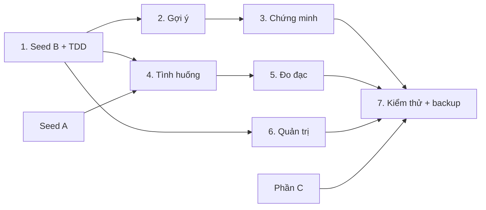

# Quân — kế hoạch thành viên B (`--deep --tdd`)

## Overview

Quân thực hiện đủ phần B: seed dấu hiệu/chứng minh, gợi ý định lý, chứng minh mẫu, tình huống, đo đạc, quản trị bài tập, kiểm thử chéo C và backup/restore. **HOLD SCOPE**: giữ cả Must và Should của Release 1. Source lập plan `main@f3f6172`, nhánh bàn giao đã tích hợp `origin/main@95a8519`; phần B đã được triển khai trên `feature/B-ap-dung`, có DB/HTTP thật và backup drill. Checklist phase là tiến độ thực tế; bảng dưới là mốc lập kế hoạch. Các gate review A/C, UI và Windows còn mở; xem [báo cáo thực thi](reports/execution-B.md).

Nguồn: [Jira CSV](../../docs/GeoQuad_Jira_2ngay.csv), [SRS](../../docs/GeoQuad_SRS.md), [README/hợp đồng kỹ thuật](../../README.md). CSV quyết định phân công, SRS quyết định nghiệp vụ, README quyết định ownership/URL. [Ma trận truy vết](reports/traceability.md) phân biệt Issue ID CSV với mã story; chưa có Jira key thật để cập nhật từ xa.

## Goals

| Phạm vi của Quân | Jira Issue ID | Điểm |
|---|---|---|
| US-13, US-14, US-17, US-18, US-25 | 51, 55, 66, 70, 98 | 24 chức năng |
| Owner chung US-02, US-03, US-27 | 14, 16, 109 | 10 đứng tên |
| Sub-task B US-02/03/04/07/26/27 | 15, 18, 23, 30, 104, 107, 111 | Không cộng điểm cha lần nữa |

**Tổng đứng tên 34 điểm; điểm không quy đổi trực tiếp thành giờ.** 26h là ước lượng làm việc tập trung (chưa kể chờ review/merge của A/C); lịch 07–08/10 trong CSV là lịch gốc, seed của B đang trễ. Thứ tự dưới đây bắt đầu từ lúc triển khai, không ngầm bỏ Should để ép vào một ngày.

## Phases

| # | Phase | Phụ thuộc | Ước lượng | Status |
|---|---|---|---|---|
| 1 | [Khung kiểm thử, seed B và review nội dung](phase-01-start.md) | Khung 0 | 4h | Pending |
| 2 | [US-13: Gợi ý định lý và chuỗi trung gian](phase-02-goi-y-dinh-ly.md) | 1 | 5h | Pending |
| 3 | [US-14: Chứng minh mẫu](phase-03-chung-minh-mau.md) | 1, 2 | 2h | Pending |
| 4 | [US-17: Tình huống thực tế](phase-04-tinh-huong-thuc-te.md) | 1; seed A | 2h | Pending |
| 5 | [US-18: Thực hành đo đạc](phase-05-thuc-hanh-do-dac.md) | 1, 4 | 4h | Pending |
| 6 | [US-25: Quản trị bài tập](phase-06-quan-tri-bai-tap.md) | 1 | 5h | Pending |
| 7 | [US-26/27: Backup, kiểm thử và bàn giao](phase-07-backup-kiem-thu-ban-giao.md) | 1–6; C hoàn thiện | 4h | Pending |

## Ownership và kiến trúc

B sở hữu `Areas/ApDung/**`, `Areas/QuanTri/**`, seed `20-dinhly-B.cypher`, `21-chungminh-B.cypher`, `tests/GeoQuad.Tests/B_ApDung/**`, `docs/cypher/B-ap-dung.md`. Tích hợp: `scripts/backup.sh/.ps1`, `scripts/restore.sh/.ps1` và mục B trong `docs/kiem-thu.md`; A cập nhật README, C cập nhật demo. Các phase chạy tuần tự; nhiều phase cùng bổ sung module/docs nên không dùng `cook --parallel`.

Tái sử dụng `IGraphDb`, `ICurrentUser`, `IAuthHelper`, auth/layout và module DI có sẵn; không sửa khung chung, csproj hay file A/C. Controller → service nghiệp vụ → repository Cypher tham số; xUnit/fake viết tay cho logic và Neo4j/container riêng cho integration. Không thêm package để né ownership. Mỗi phase 2–7 **scout lại source, seed và dependencies trước khi code**; phase 1 được thiết kế chi tiết theo checkout hiện tại.

## Dependencies và quyết định thiết kế

A cung cấp tính chất, công thức, 9 tình huống và trang chi tiết hình; C review nội dung seed B, cung cấp bài tập/tiến độ cho kiểm thử ẩn bài. Seed khác chủ chỉ MERGE nhãn gốc + mã. Endpoint public Area ApDung, kể cả chi tiết/POST, lọc lớp và DA_RA_SOAT; kiến thức placeholder thiếu lớp bị chặn. QuanTri role-gated quản lý mọi lớp/trạng thái theo bộ lọc admin, không lọc bằng lớp của tài khoản admin.

Sai số đo: `abs(a-b)/max(a,b) <= ε`, biên được chấp nhận; đầu vào chọn một đơn vị và ε trong `(0,100)%`. Mã bài bất biến sau tạo. BR-08 của chứng minh dùng đường `ChungMinh→DauHieu→KhaiNiem` hiện có. Đây là quy ước thiết kế được ghi rõ trong phase, không phải câu chữ có sẵn của SRS. [Research](research/requirements-B.md) và [thiết kế kiểm thử](research/tdd-architecture-B.md) ghi bằng chứng và lý do.

## Success Criteria

- [ ] Đủ seed B, chạy A→B/B→A và chạy lặp không trùng; C ký review nội dung trước DA_RA_SOAT.
- [ ] AC của cả 5 story chức năng đạt, có test RED→GREEN và test DB/HTTP thật; không dùng test mẫu để đóng story.
- [ ] Auth/CSRF, rollback, giữ DA_LAM, lớp/nâng cao và 360px được kiểm tra; từng Cypher có giải thích/kết quả thực tế.
- [ ] Quân kiểm thử toàn phần C, chạy lại ≥2 Cypher; A kiểm thử B; restore vào volume cô lập thành công.

## Validation Log / Red Team Review

Đã qua review4lenses; sửa7findings của draft; CLI validate đạt và195 structural/link checks đạt (xem [validation](reports/validation.md), [red-team](reports/red-team.md)). Build/test70case trước chỉ là baseline; thiếu runtime .NET8/Docker chưa chạy khi kiểm tra, chưa nghiệm thu DB/HTTP/test B. Checklist phase là nguồn tiến độ, task index cục bộ `GeoQuad/261008-0132` chiếu7phase, không post Jira.

## Handoff

Code B, scripts, test và docs được bàn giao trong đợt commit/push này trên feature/B-ap-dung. .NET8/Docker test riêng đã chạy. Tiếp theo: C review seed trước DA_RA_SOAT, A test B, C hoàn thiện reader và ≥2query, owner chạy browser360px/keyboard/4G/KaTeX và WindowsPowerShell, rồi README/demo chung. Giữ plan in-progress đến khi có đủ evidence.

<!-- slug: quan-b-ap-dung-tdd -->

## Publication checkpoint

User cho phép CSV→commit/push→PR trên một nhánh; 27 dòng B được cập nhật status/comment, phần A/C giữ nguyên. Backend5subtask Done, các gate Browser/review/Windows/cross-C chưa đóng. Build/unit sau tích hợp A/main đạt415tests; 14integration sau tích hợp main đã đạt trước publish; PR giữ draft đến khi có evidence các gate còn mở.
