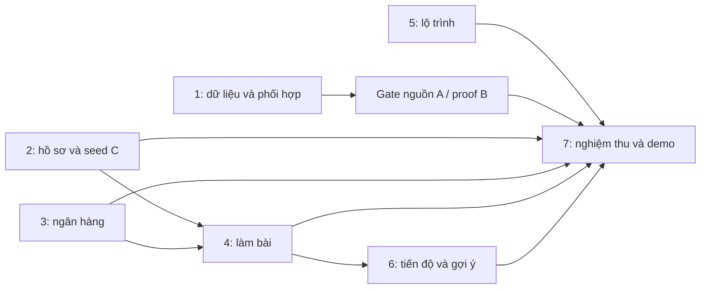

# Định C — `/ak-plan --tdd --deep`

## Outcome và phạm vi

Hoàn thiện toàn bộ việc C được phân công: điều phối US-01/05/06, kickoff US-05, rà soát US-03, seed US-04 C, US-08, US-19–24, kiểm thử chéo US-26 và demo US-27. Đây là cập nhật plan; việc triển khai theo từng phase diễn ra sau. Giữ đủ Must và Should, không tính story cha hai lần.

Nguồn: [README](../../README.md), [SRS](../../docs/GeoQuad_SRS.md), [Jira CSV](../../docs/GeoQuad_Jira_2ngay.csv). [Traceability và scout](research/scope-and-scout.md) liệt kê AC, ownership, bằng chứng và các điểm cần phối hợp. Baseline `feature/C-hoc-tap@ba99d9e` + working tree chưa commit ngày 08/10/2026; đọc lại HEAD/diff trước khi thực hiện.

## Tiến độ thực tế

| Phần | Đã có bằng chứng từ phiên trước | Việc còn mở |
|---|---|---|
| US-03 | Chạy seed hai thứ tự, chạy lặp, đếm 14/20/12/12/6; 40 mục B20 đã rà soát và đổi trạng thái trong working tree; Compose seed hai lần ổn định | Nguồn/lớp CT_HBH_DT, CT_THOI_DT của A; xác nhận phối hợp, không tự đóng story cha |
| US-04 C | Seed C đã push/merge; 20 bài: 7 trắc nghiệm, 10 số, 3 chứng minh, 6 thoi; DB toàn nhóm 30/9/4 | Proof B21 còn NHAP, BT-027 → CM-01 chưa đạt public |
| US-08 | Code, unit và HTTP thật đã chạy; đổi thông tin/password/xóa/logout | UI 360px, các ca CSRF và xóa lịch sử cần bổ sung evidence |
| US-19 | Bộ lọc, lịch sử, repository/service/view; C suite 21/21 và HTTP có evidence | UI 360px/keyboard/KaTeX, cross-review B |
| US-20–24 | Lam/KeTiep/LoTrinh/TienDo/GoiY còn stub | Triển khai theo phase 4–6 |
| Chung/US-26/27 | Phân công có trong README/CSV | Evidence kickoff, điều phối, kiểm thử A, demo và rehearsal |

Docker đã chạy và seed được; lỗi permission trước đây đã xử lý bằng quyền chạy công cụ. SDK 9 có thể build target net8 khi runtime cần thiết có sẵn. Không tiếp tục coi hai điều này là blocker đã xác nhận. Evidence cũ nằm trong [tài liệu C](../../docs/cypher/C-hoc-tap.md), không phải kết quả chạy mới của lần lập plan này.

## Phases và thứ tự

| # | Phase | Trạng thái | Ước lượng còn lại |
|---|---|---|---|
| 1 | [Chung, kickoff, rà soát US-03](phase-01-start.md) | In progress | 2h |
| 2 | [US-04, US-08 và proof gate](phase-02-us04-us08-xac-minh.md) | In progress | 3h |
| 3 | [Hoàn tất US-19](phase-03-us19-ngan-hang-bai-tap.md) | In progress | 2h |
| 4 | [US-20 làm/chấm bài, US-21 mẫu chứng minh](phase-04-us20-us21-lam-bai.md) | Pending | 8h |
| 5 | [US-22 lộ trình](phase-05-us22-lo-trinh.md) | Pending | 6h |
| 6 | [US-23 tiến độ, US-24 gợi ý/KeTiep](phase-06-us23-us24-tien-do-goi-y.md) | Pending | 7h |
| 7 | [US-26 kiểm thử chéo, US-27 demo](phase-07-us26-us27-ban-giao.md) | Pending | 5h |

Fixture C dùng chung (F) là prerequisite DB/HTTP phase4/5/6, có thể scaffold trước phần code US20; không chặn RED unit US22. Phase6 chỉ phụ thuộc lịch sử US20; link roadmap fallback nghiệm thu sau phase5 ở phase7.

Dependency ở cấp task: có thể bắt đầu RED US-20/22 ngay sau scout, không phải chờ UI360px hay finding A được giải quyết. Proof gate chặn AC link US-21; US-24 chặn hoàn thiện KeTiep của học sinh; các gate này phải đóng trước nghiệm thu cuối. Ước lượng là thời gian công việc còn lại, không phải cam kết hoàn tất trong một ngày.

## Quy ước thực thi

Mỗi phase có inventory, test matrix, RED → GREEN → REFACTOR → regression, AC và task checklist. Trước mỗi phase scout lại file liên quan và seed đang dùng; cập nhật plan khi hợp đồng thật khác dự kiến. Lệnh và môi trường chung ở [execution contract](research/execution-contract.md). Không có runtime task manager phù hợp trong phiên này; checkbox trong 7 phase là danh sách task chính thức, index AgentKit được đồng bộ bằng CLI.

C sở hữu `Areas/HocTap/**`, `C_HocTap/**`, seed/dev C và tài liệu C. Các sửa đổi shared/A/B được ghi finding để đúng chủ sở hữu xử lý. Ngoại lệ đã được người dùng cho phép: trạng thái B20 sau rà soát US-03; không suy rộng thành quyền thay toàn bộ B. Nguồn là nội dung tự biên soạn, rà toán học và đối chiếu khung chương trình; không nhận là đã đối chiếu một bộ SGK chưa chọn.

## Gate nghiệm thu

- [ ] Mọi AC C trong traceability có test/evidence thật, tên người rà soát và việc còn mở.
- [ ] Public chỉ hiển thị nội dung hợp lệ; lịch sử tài khoản riêng tư; GET làm bài không chứa đáp án; POST CSRF và kiểm tra lại lớp/trạng thái ở server.
- [ ] Gợi ý/lộ trình dùng lớp thực; danh sách public dùng lớp hiển thị và nhãn nâng cao.
- [ ] Unit, DB cô lập, HTTP và UI360px/desktop đạt; cross-review B→C và C→A có evidence.
- [ ] Kickoff/điều phối/demo hoàn tất; story cha chỉ đóng khi đủ phần A/B/C.

## Red Team Review

Đã review4 lenses và sửa các điểm kỹ thuật trong phạm vi hoàn thiện plan. Xem [red-team](reports/red-team.md) và [validation](reports/validation.md).

### Whole-Plan Consistency Sweep

Tiến độ, lớp DB hiện tại, guest cookie không Session, replay immutable, lock DA_HOC, fixture70%/40%, handshake DBC và đường dẫn/lệnh đã đối chiếu toàn plan. Không có mâu thuẫn kỹ thuật còn mở; nguồn A/proof B/UI/peer review là gate thực thi được liệt kê, không được nhận là đã đạt.

## Handoff

 Bước triển khai tiếp theo: phase 4 RED US-20 song song về mặt phụ thuộc với phần còn lại phase 1–3; thực thi tuần tự theo người làm, không tự chia file cho nhiều người. Không chạy test ứng dụng, đổi Jira, commit hoặc push trong lần lập plan này.

<!-- slug: dinh-c-hoc-tap-tdd-deep -->
